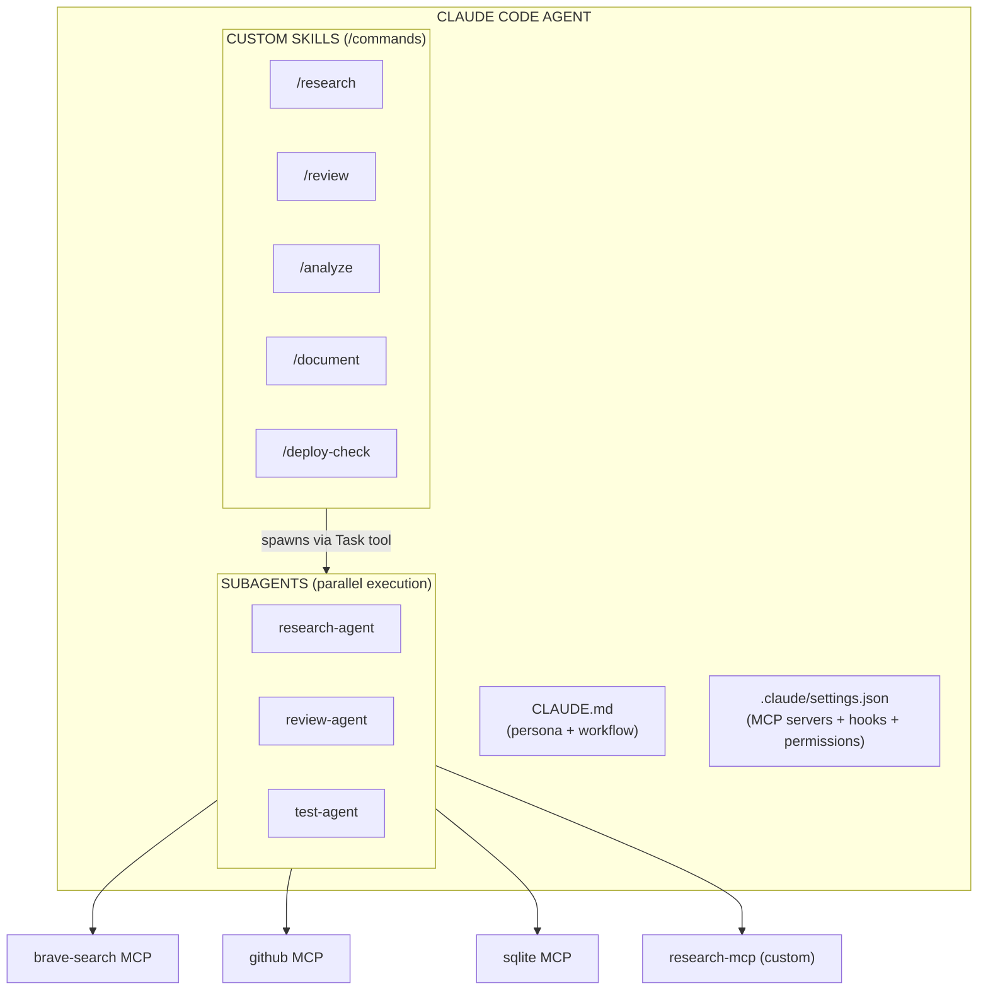
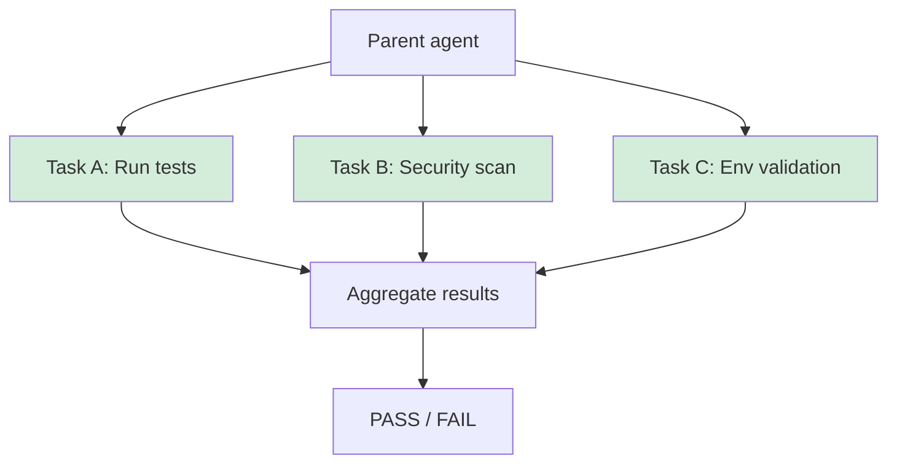
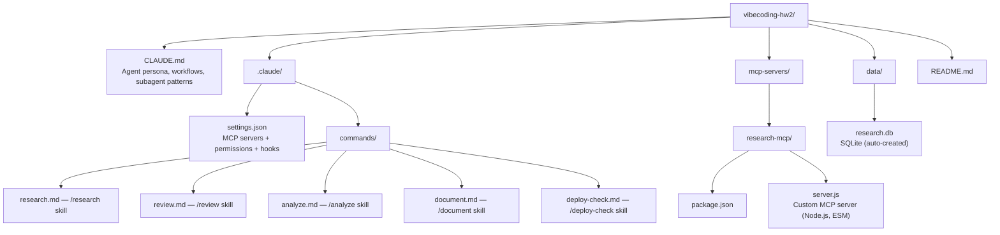

# Senior Research/Dev Agent Setup

> **Claude Code** agent configuration for a senior research/developer.
> Demonstrates: MCP Servers, Custom Skills (slash commands), Subagent dispatch.

---

## Architecture Overview



---

## Quick Start

### 1. Clone / enter your project

```bash
cd your-project/
```

### 2. Install MCP servers (npm global)

```bash
# Official MCP servers (no plugins/marketplace)
npm install -g @modelcontextprotocol/server-filesystem
npm install -g @modelcontextprotocol/server-github
npm install -g @modelcontextprotocol/server-brave-search
npm install -g @modelcontextprotocol/server-sqlite
```

### 3. Install custom research-mcp

```bash
cd mcp-servers/research-mcp
npm install
cd ../..
```

### 4. Set environment variables

```bash
export GITHUB_TOKEN="ghp_your_token_here"
export BRAVE_API_KEY="BSA_your_key_here"
```

### 5. Start Claude Code

```bash
claude
```

Claude Code will automatically detect `.claude/settings.json` and connect all MCP servers.

---

## MCP Servers

| Server | Source | Purpose |
|--------|--------|---------|
| `filesystem` | `@modelcontextprotocol/server-filesystem` | Scoped file operations |
| `github` | `@modelcontextprotocol/server-github` | Issues, PRs, code search |
| `brave-search` | `@modelcontextprotocol/server-brave-search` | Real-time web search |
| `sqlite` | `@modelcontextprotocol/server-sqlite` | Local research DB |
| `research-mcp` | **Custom** (this repo) | arXiv + summarization |

### Custom MCP: research-mcp

Built from scratch using `@modelcontextprotocol/sdk`. Exposes 4 tools:

| Tool | Description |
|------|-------------|
| `fetch_arxiv` | Query arXiv API, return structured paper metadata |
| `summarize_paper` | Extract contribution / methods / results from abstract |
| `store_finding` | Persist finding to SQLite |
| `list_findings` | Query stored findings with topic filter |

**Source:** `mcp-servers/research-mcp/server.js`

---

## Skills (Custom Slash Commands)

All commands live in `.claude/commands/`. They are automatically available as `/command-name` in Claude Code.

### `/research <topic>`
Full research pipeline: Brave Search + arXiv via **2 parallel subagents** → merge → store in SQLite → formatted report.

### `/review <path>`
Deep code review: static analysis (lint, type-check, security) + **2 parallel subagents** (logic review + architecture review) → structured JSON report with PASS/FAIL verdict.

### `/analyze <path-or-question>`
Smart analysis: auto-detects code vs data vs root-cause mode. Spawns focused subagent. Returns metrics, hotspots, anomalies.

### `/document <path>`
Auto-documentation: extracts public API surface → **doc-writing subagent** → outputs `docs/API.md`, `docs/QUICKSTART.md`, updates README.

### `/deploy-check`
Pre-flight validation: **3 parallel subagents** (test runner, security scanner, env validator) → aggregate → PASS or BLOCKED gate.

---

## Subagent Architecture

Subagents are spawned using Claude Code's built-in `Task` tool. Each subagent:
- Runs in its own context (no shared state with parent)
- Can use all MCP tools
- Returns structured output (JSON or Markdown) to the parent agent
- Multiple subagents run **in parallel** when tasks are independent

### Parallel dispatch example (from `/deploy-check`):



---

## Hooks

Configured in `.claude/settings.json` under `"hooks"`:

| Hook | Trigger | Action |
|------|---------|--------|
| `PreToolUse (Bash)` | Before any shell command | Log command to `session-notes.md` |
| `PreToolUse (Write)` | Before file write | Log file path to `session-notes.md` |
| `PostToolUse (Bash)` | After shell command fails | Log error with timestamp |

---

## File Structure



---

## Requirements

- **Claude Code** CLI (`npm install -g @anthropic-ai/claude-code`)
- **Node.js** ≥ 20
- **npm** ≥ 9
- API keys: `GITHUB_TOKEN`, `BRAVE_API_KEY`

---

*Homework 2 — Vibecoding | Pavel Hradecký | 2026-05-12*
