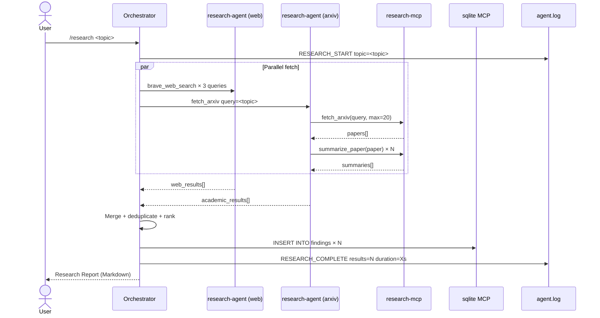
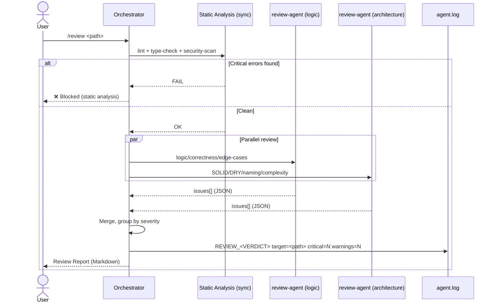
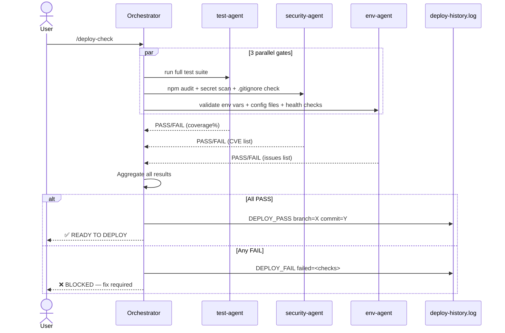
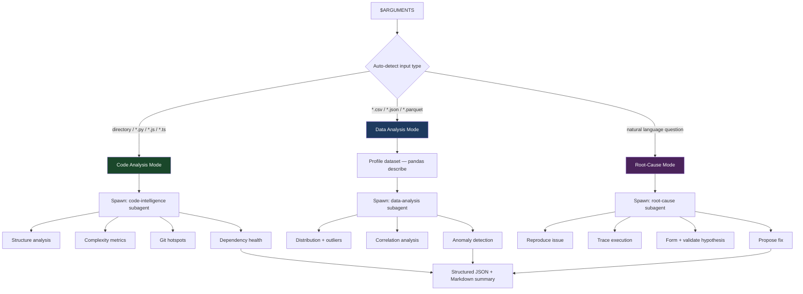

# Agent Workflows

All agents are spawned via the **Task tool** from the main Claude orchestrator. Each runs in an isolated context and returns a structured result.

---

## Agent Roster

| Agent | Trigger | Tools Used | Output |
|-------|---------|-----------|--------|
| `research-agent` | `/research <topic>` | brave-search, research-mcp, sqlite | Ranked findings + report |
| `review-agent` | `/review <path>` | Bash, Read, rg | JSON severity report |
| `test-agent` | `/analyze <path>` | Bash, Read | Coverage + failure report |
| `doc-agent` | `/document <path>` | Read, Write, Bash | docs/API.md + README update |
| `security-agent` | `/deploy-check` | Bash (npm audit, bandit) | CVE list + secrets scan |
| `env-agent` | `/deploy-check` | Read, Bash | Config validation report |

---

## Research Pipeline (`/research`)

---

## Code Review Pipeline (`/review`)

---

## Deploy-Check Pipeline (`/deploy-check`)

---

## Analyze Pipeline (`/analyze`)

