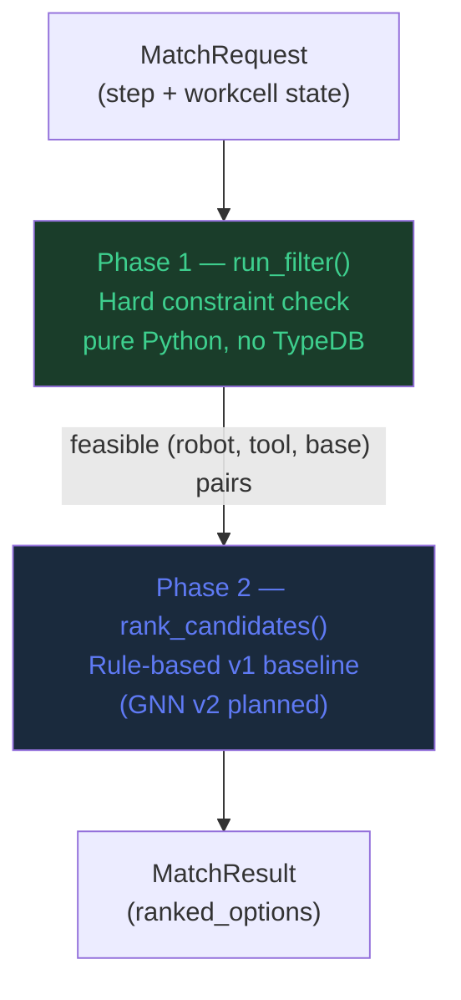

# Capability Matcher — API Reference

**Package:** `capability_matcher`  
**Python:** ≥ 3.11  
**Version:** 0.1.0

---

## Architecture



---

## Data Models (`capability_matcher.models`)

### `ToolSpec`

Static specification of a gripper/tool loaded from `tools.json`.

| Field | Type | Description |
|-------|------|-------------|
| `tool_id` | `int` | Unique tool identifier |
| `label` | `str` | Human label (e.g. `"T2"`) |
| `model` | `str` | Manufacturer model string |
| `type` | `str` | `"electric_finger"` \| `"pneumatic_finger"` \| `"suction"` \| `"calibration"` |
| `can_grip` | `bool` | Supports Grip/Release operations |
| `can_reference` | `bool` | Supports Reference/AcknowledgeError (electric only) |
| `grip_range_um` | `list[int]` | `[min, max]` open position range in µm |
| `payload_kg` | `float` | Maximum payload in kg |

---

### `RobotSpec`

Static specification of a robot loaded from `robots.json`.

| Field | Type | Description |
|-------|------|-------------|
| `robot_id` | `int` | Unique robot identifier (1–3) |
| `label` | `str` | Human label (e.g. `"R1"`) |
| `model` | `str` | Robot model |
| `supported_ops` | `list[int]` | V4 operation IDs this robot supports |
| `toolchangers` | `list[ToolchangerSlot]` | Tool rack slots with assigned tool IDs |

---

### `PositionSpec`

Loaded from `resources/montrac/maze-positions/{name}.json`.

| Field | Type | Description |
|-------|------|-------------|
| `position_name` | `str` | Unique position identifier |
| `description` | `str` | Human-readable description |
| `valid_bases` | `list[PositionValidBase]` | Per-robot list of reachable base frame IDs |
| `valid_tools` | `list[PositionValidTool]` | Tools valid at this position, each with required `open_position` (µm) |
| `position` | `dict[str, float]` | Cartesian coords: `X, Y, Z` (mm), `A, B, C` (degrees) |

---

### `ProcessStep`

One step in an assembly/disassembly sequence.

| Field | Type | Default | Description |
|-------|------|---------|-------------|
| `step_index` | `int` | — | Step sequence number (1-based) |
| `step_name` | `str` | — | Human label |
| `op_index` | `int` | — | V4 operation ID (e.g. `21` = PickVertical) |
| `component` | `str` | — | Part ID being manipulated |
| `position_name` | `str` | — | Target position name (must exist in `maze-positions/`) |
| `preconditions` | `list[str]` | `[]` | State tokens that must be satisfied before this step |
| `postconditions` | `list[str]` | `[]` | State tokens asserted after this step completes |

---

### `RobotRuntimeState`

Current OPC UA state of one robot. In Mode A, populated from a JSON file or defaults.

| Field | Type | Default | Description |
|-------|------|---------|-------------|
| `robot_id` | `int` | — | Robot identifier |
| `enabled` | `bool` | `True` | OPC UA `Enabled` node |
| `busy` | `bool` | `False` | `Program.Busy` — program currently running |
| `ready` | `bool` | `True` | `Program.Ready` — ready for new operation |
| `error_id` | `int` | `0` | `Status.Error_ID` — 0 means no error |
| `manually_disabled` | `bool` | `False` | `Status.Manually_Disabled` |
| `tool_id` | `int` | `0` | ID of currently attached tool |
| `tool_attached` | `bool` | `True` | `Tool.Status.Attached` |
| `active_base_id` | `int` | `11` | `Status.Base_Frame_ID` — active coordinate frame |

> **Edge case:** A robot with `tool_id=0` or `tool_attached=False` always fails the filter, even if other conditions are met.

---

### `WorkcellRuntimeState`

Snapshot of the full workcell.

| Field | Type | Default | Description |
|-------|------|---------|-------------|
| `estop_ok` | `bool` | `True` | `W1.Status.Emergency_Stop_OK` |
| `conveyor_running` | `bool` | `True` | `Montrac.Status.montracSystemRunning` |
| `robots` | `list[RobotRuntimeState]` | `[]` | State of each robot |

> **Edge case:** If `estop_ok=False`, every robot fails regardless of individual state.

---

### `MatchRequest`

Input to the capability matcher.

| Field | Type | Description |
|-------|------|-------------|
| `step` | `ProcessStep` | The process step to match |
| `workcell` | `WorkcellRuntimeState` | Current workcell snapshot |

---

### `RobotCandidate`

One feasible assignment returned by the filter and scored by the ranker.

| Field | Type | Description |
|-------|------|-------------|
| `robot_id` | `int` | Robot that can execute the step |
| `tool_id` | `int` | Tool currently attached to that robot |
| `active_base_id` | `int` | Active base frame at time of matching |
| `score` | `float` | Suitability score ∈ [0, 1] (higher = preferred) |
| `violations` | `list[ConstraintViolation]` | Always empty for passing candidates |

---

### `MatchResult`

Output of one matching call.

| Field | Type | Description |
|-------|------|-------------|
| `step_index` | `int` | Index of the matched step |
| `step_name` | `str` | Name of the matched step |
| `position_name` | `str` | Target position |
| `ranked_options` | `list[RobotCandidate]` | Candidates sorted descending by score |
| `fallback_used` | `bool` | `True` when rule-based ranker used (GNN not yet trained) |
| `best` | `RobotCandidate \| None` | Property — first element of `ranked_options` |

---

## Phase 1 — Constraint Filter (`capability_matcher.filter`)

### `run_filter(request: MatchRequest) → list[RobotCandidate]`

Evaluates every robot in `request.workcell.robots` against all hard constraints
for the requested step. Returns only passing candidates, sorted by `robot_id` ascending.

**Hard constraints checked (in order):**

| Constraint | Fails when |
|-----------|-----------|
| `enabled` | `robot.enabled = False` |
| `manually_disabled` | `robot.manually_disabled = True` |
| `error_id` | `robot.error_id ≠ 0` |
| `busy` | `robot.busy = True` |
| `ready` | `robot.ready = False` |
| `estop` | `workcell.estop_ok = False` |
| `op_supported` | `step.op_index ∉ robot_spec.supported_ops` |
| `tool_attached` | `robot.tool_attached = False` or `robot.tool_id = 0` |
| `tool_valid` | `robot.tool_id ∉ position.valid_tools` |
| `base_reachable` | `robot.active_base_id ∉ position.valid_bases[robot_id]` |

```python
from capability_matcher.filter import run_filter
from capability_matcher.models import MatchRequest, ProcessStep, RobotRuntimeState, WorkcellRuntimeState

step = ProcessStep(
    step_index=1, step_name="Pick START Insert",
    op_index=21, component="START-INSERT_106",
    position_name="maze_106_pick_insert_start",
)
workcell = WorkcellRuntimeState(robots=[
    RobotRuntimeState(robot_id=1, tool_id=2, active_base_id=11),
    RobotRuntimeState(robot_id=2, tool_id=9, active_base_id=11),  # wrong tool → filtered
])

candidates = run_filter(MatchRequest(step=step, workcell=workcell))
# → [RobotCandidate(robot_id=1, tool_id=2, score=0.0)]
```

> **Edge case:** If `position_name` has no `valid_bases` entry for a given `robot_id`,
> that robot is excluded. Positions are robot-specific by design.

### `run_filter_verbose(request: MatchRequest) → tuple[list[RobotCandidate], list[RobotCandidate]]`

Same as `run_filter` but returns `(passing, rejected)`. Rejected candidates have
`violations` populated with every constraint that failed.

```python
from capability_matcher.filter import run_filter_verbose

passing, rejected = run_filter_verbose(MatchRequest(step=step, workcell=workcell))
for c in rejected:
    for v in c.violations:
        print(f"R{c.robot_id}: [{v.constraint}] {v.detail}")
```

---

## Phase 2 — Ranker (`capability_matcher.ranker`)

### `rank_candidates(candidates, request) → list[RobotCandidate]`

Assigns scores to the feasible set and returns them sorted descending.

**Score formula (v1 rule-based):**
```
score = 0.6 × history_rate + 0.4 × priority_weight

history_rate   — AVG(success) from execution_history SQLite table (default 0.5 if no data)
priority_weight — {R1: 1.0, R2: 0.95, R3: 0.90, other: 0.5}
```

> **Note:** This ranker is the v1 baseline. When `models/gat_ranker.pt` exists,
> a GNN-based ranker will replace it automatically (planned for v2).

---

## Core Orchestrator (`capability_matcher.matcher`)

### `class CapabilityMatcher`

Main entry point. Initialises the SQLite `execution_history` table on construction.

#### `match(request: MatchRequest) → MatchResult`

Run Phase 1 filter then Phase 2 ranker. Returns ranked candidates.
Raises nothing — returns empty `ranked_options` if no robot is feasible.

```python
from capability_matcher import CapabilityMatcher
from capability_matcher.models import MatchRequest, ProcessStep, RobotRuntimeState, WorkcellRuntimeState

matcher = CapabilityMatcher()

result = matcher.match(MatchRequest(
    step=ProcessStep(
        step_index=1, step_name="Pick START Insert",
        op_index=21, component="START-INSERT_106",
        position_name="maze_106_pick_insert_start",
    ),
    workcell=WorkcellRuntimeState(robots=[
        RobotRuntimeState(robot_id=1, tool_id=2, active_base_id=11),
    ]),
))

print(result.best)
# RobotCandidate(robot_id=1, tool_id=2, active_base_id=11, score=0.7, violations=[])
```

#### `match_plan(requests: list[MatchRequest]) → list[MatchResult]`

Match multiple steps sequentially. Returns one `MatchResult` per request in the same order.

```python
from capability_matcher.loader import load_process_steps

steps = load_process_steps()
workcell = WorkcellRuntimeState(robots=[...])
results = matcher.match_plan([MatchRequest(step=s, workcell=workcell) for s in steps])
```

> **Edge case:** Steps are matched independently — `match_plan` does not enforce
> precondition ordering. Order enforcement is the caller's responsibility.

#### `record_outcome(step_index, robot_id, tool_id, op_index, call_id, success) → None`

Persist execution outcome to `execution_history` for ranker learning.

| Parameter | Type | Description |
|-----------|------|-------------|
| `step_index` | `int` | Step that was executed |
| `robot_id` | `int` | Robot that executed it |
| `tool_id` | `int` | Tool that was attached |
| `op_index` | `int` | V4 operation ID |
| `call_id` | `int \| None` | OPC UA `Call_ID` returned by `StartRobotOperation` |
| `success` | `bool` | Whether `Result_Code = 0` |

---

## Loaders (`capability_matcher.loader`)

All loaders are `@lru_cache` — first call reads from disk, subsequent calls return cached.

| Function | Returns | Source |
|----------|---------|--------|
| `load_robots()` | `dict[int, RobotSpec]` | `resources/montrac/robots.json` |
| `load_tools()` | `dict[int, ToolSpec]` | `resources/montrac/tools.json` |
| `load_process_steps(product)` | `list[ProcessStep]` | `resources/montrac/process_steps.json` |
| `load_position(name)` | `PositionSpec` | `resources/montrac/maze-positions/{name}.json` |
| `load_all_positions()` | `dict[str, PositionSpec]` | All 57 position files |

---

## REST API (`capability_matcher.api`)

Base URL: `http://localhost:8080`  
Interactive docs: `http://localhost:8080/docs`

### `GET /health`

```json
{"status": "ok"}
```

### `GET /steps`

Returns all 18 Maze 106 process steps as JSON array.

### `POST /match`

**Request body:** `MatchRequest`

**Response:** `MatchResult`

**409 Conflict** if no feasible robot found.

```bash
curl -s -X POST http://localhost:8080/match \
  -H "Content-Type: application/json" \
  -d '{
    "step": {
      "step_index": 1, "step_name": "Pick START Insert",
      "op_index": 21, "component": "START-INSERT_106",
      "position_name": "maze_106_pick_insert_start",
      "preconditions": [], "postconditions": []
    },
    "workcell": {
      "estop_ok": true, "conveyor_running": true,
      "robots": [
        {"robot_id": 1, "tool_id": 2, "active_base_id": 11,
         "enabled": true, "busy": false, "ready": true,
         "error_id": 0, "manually_disabled": false,
         "tool_attached": true}
      ]
    }
  }'
```

### `POST /match/plan`

**Request body:** `list[MatchRequest]`

**Response:** `list[MatchResult]`

### `POST /outcome`

Record an execution outcome for ranker learning.

**Request body:**

```json
{
  "step_index": 1,
  "robot_id": 1,
  "tool_id": 2,
  "op_index": 21,
  "call_id": 1042,
  "success": true
}
```

**Response:** 204 No Content

---

## Scripts

### `scripts/generate_training_data.py`

```bash
python src/scripts/generate_training_data.py [--scenario NAME] [--samples N] [--seed N]
```

| Arg | Default | Description |
|-----|---------|-------------|
| `--scenario` | all 5 | Run one scenario only |
| `--samples` | 1000 | Samples per scenario |
| `--seed` | 42 | RNG seed for reproducibility |

**Scenarios:** `MAZE_106_Assembly`, `MAZE_106_R2_Error`, `MAZE_106_Wrong_Tool`, `MAZE_106_R1_Busy`, `MAZE_106_Degraded`

**Output schema** per JSONL line:

```json
{
  "scenario": "MAZE_106_Assembly",
  "step_index": 3,
  "position_name": "maze_106_pick_insert_finish",
  "op_index": 21,
  "graph": {
    "step_features": [0,0,0,0,0,1,0,0,0,0,0,0,0,0],
    "nodes": [{"robot_id": 1, "features": [0.0, 1.0, 1.0, 1.0, 1.0, 0.125, 0.367]}],
    "edges": [{"src": "step", "dst": "robot_1", "type": "requires"}]
  },
  "labels": {"1": 1.0, "2": 0.0, "3": 0.85},
  "feasible_count": 2
}
```

**Labels:** `1.0` = highest-priority feasible, `0.x` = secondary feasible (descending by rank), `0.0` = infeasible.

---

### `scripts/seed_kg.py`

```bash
python src/scripts/seed_kg.py [--host H] [--port P] [--db DB] [--dry-run]
```

Loads all JSON fixtures and inserts into TypeDB 3. `--dry-run` prints TypeQL without connecting.

Requires `typedb-driver==3.10.0`. Reads `TYPEDB_USERNAME` / `TYPEDB_PASSWORD` from environment
(defaults: `admin` / `password`). All TypeDB operations are logged to `data/logs/typedb.log`.

```bash
# Dry-run (no connection required)
PYTHONPATH=src python src/scripts/seed_kg.py --dry-run

# Live seed (TypeDB must be running)
TYPEDB_USERNAME=admin TYPEDB_PASSWORD=password \
PYTHONPATH=src python src/scripts/seed_kg.py --host localhost --port 1729 --db capability_kg
```

---

### `scripts/run_mode_a_tests.py`

Automated integration test runner for all 7 Mode A use cases from `docs/TESTING.md`.
Uses the Python API directly (not subprocess). Runs against a temporary SQLite DB so
scores are deterministic regardless of prior execution history.

```bash
# Run all 7 test cases
PYTHONPATH=src python -m scripts.run_mode_a_tests

# Verbose — shows each check's pass/fail with detail
PYTHONPATH=src python -m scripts.run_mode_a_tests --verbose

# JUnit XML for CI
PYTHONPATH=src python -m scripts.run_mode_a_tests --junit data/results/junit.xml
```

Exit code: `0` = all pass, `1` = any failure.

---

### `scripts/train_gnn.py`

```bash
python src/scripts/train_gnn.py [--epochs N] [--lr F] [--hidden N] [--batch-size N]
```

Requires `pip install -r src/requirements-ml.txt`. Reads all `data/training/*/samples.jsonl`, trains a 2-layer GAT, saves best checkpoint to `models/gat_ranker.pt`.

| Arg | Default | Description |
|-----|---------|-------------|
| `--epochs` | 100 | Training epochs |
| `--lr` | 5e-4 | Adam learning rate |
| `--hidden` | 64 | Hidden dimension per GAT layer |
| `--batch-size` | 32 | PyG DataLoader batch size |

**Model architecture:**
```
Input: node_features (7) + step_one_hot (14) = 21 dims per robot node
→ GATConv(21 → 64, heads=4, concat=True)   # → 256 dims
→ ELU
→ GATConv(256 → 64, heads=1)
→ ELU
→ Linear(64 → 1)
→ Sigmoid
Output: score ∈ [0, 1] per robot node
```

---

## Changelog

### v0.1.0 — 2026-05-12

- Initial implementation: Phase 1 constraint filter (pure Python)
- Rule-based ranker (v1 baseline) with SQLite history scoring
- FastAPI REST API (`/match`, `/match/plan`, `/outcome`, `/steps`, `/health`)
- CLI (`--step N`, `--all-steps`, `--input FILE`)
- Synthetic training data generator (5 scenarios, parametric grid)
- GAT training script skeleton
- TypeDB 3 schema + ETL script (`seed_kg.py --dry-run` verified)
- OPC UA mock server (`ns=4`, `StartRobotOperation` simulation)
- Docker Compose: TypeDB 3.10.4, capability-matcher, opcua-mock, digital-twin
- 19 unit tests (100% pass)

### v1.1.0 — 2026-05-12

- `run_filter_verbose()` returns rejected candidates with constraint violations
- CLI `--verbose` flag: shows per-robot rejection reasons and step summary
- 7 Mode A test scenarios documented in `docs/TESTING.md`
- `typedb_log.py` — structured JSON-lines logger for all TypeDB operations (`data/logs/typedb.log`)
- Automated Mode A test runner (`scripts/run_mode_a_tests.py`) with JUnit XML output
- TypeDB Studio Web container (`tools/typedb-studio-web/`) on port 8889, Docker profile `studio`
- Digital twin volume mount fix (`./resources:/resources:ro` for `digital-twin` service)

### v1.2.0 — 2026-05-12

- **typedb-driver 3.10.0**: updated from 3.1.0; new connection API (`TypeDB.driver()` + `Credentials` + `DriverOptions(is_tls_enabled=False)`)
- **TransactionType enum**: `"schema"/"write"/"read"` strings replaced with `TransactionType.SCHEMA/WRITE/READ`
- **Promise.resolve()**: `tx.query()` now returns a `Promise` that must be resolved
- **Schema cardinality**: added `@card(0..)` to `op-index`, `precondition`, `postcondition` (TypeDB 3.x defaults to max 1)
- **TypeQL role names**: `(tool: $t)` → `(capability-tool: $t)`, `(robot: $r)` → `(positioned-robot: $r)`
- **TypeQL syntax**: preconditions/postconditions now joined with `, ` (was space)
- **FastAPI 204**: `/outcome` uses `response_class=Response` to avoid body assertion error
- `TYPEDB_USERNAME` / `TYPEDB_PASSWORD` added to docker-compose and `.env.example`
