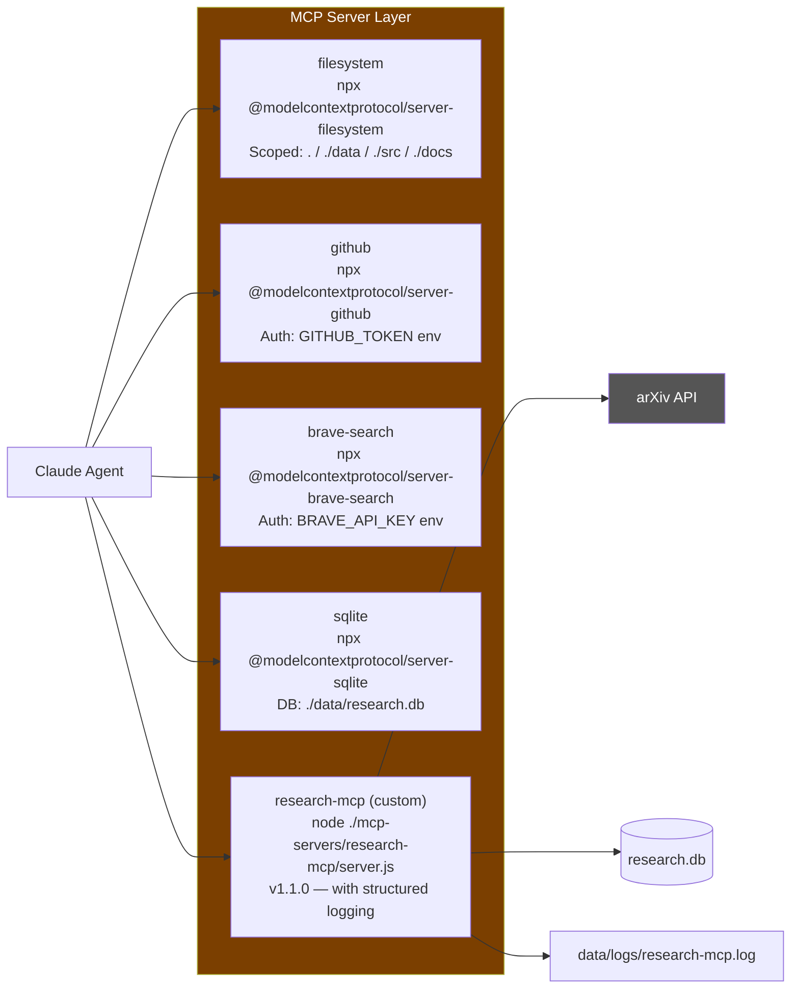
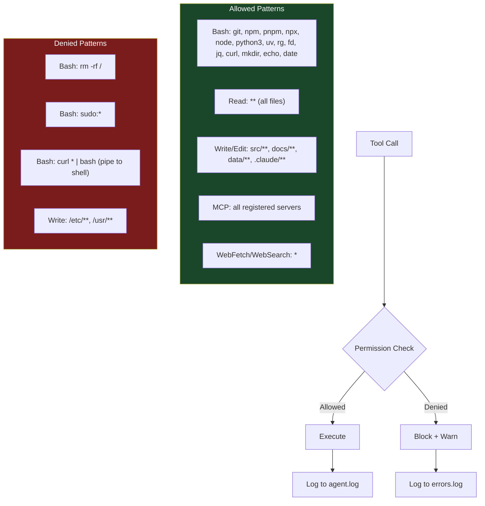

# System Architecture

## Overview

This project is a **Senior R&D Agent** platform built on Claude Code. It orchestrates parallel subagents, MCP servers, and a local SQLite store to automate research, code review, analysis, documentation, and deployment validation.

---

## High-Level Architecture

```mermaid
graph TB
    subgraph USER["User Interface"]
        CLI[Claude Code CLI]
        CMDS[Slash Commands<br/>/research /review /analyze /document /deploy-check]
    end

    subgraph CLAUDE["Claude Orchestrator"]
        ORC[Main Agent<br/>claude-sonnet-4-6]
        HOOKS[Hook System<br/>PreToolUse / PostToolUse / Stop]
        LOG_SYS[Log Router]
    end

    subgraph AGENTS["Parallel Subagents (Task tool)"]
        RA[research-agent]
        RVA[review-agent]
        TA[test-agent]
        DA[doc-agent]
        SEC[security-agent]
        ENV[env-agent]
    end

    subgraph MCP["MCP Servers"]
        FS[filesystem<br/>@modelcontextprotocol/server-filesystem]
        GH[github<br/>@modelcontextprotocol/server-github]
        BS[brave-search<br/>@modelcontextprotocol/server-brave-search]
        SQ[sqlite<br/>@modelcontextprotocol/server-sqlite]
        RM[research-mcp<br/>custom node server]
    end

    subgraph STORAGE["Persistent Storage"]
        DB[(research.db<br/>SQLite)]
        LOGS[.claude/logs/<br/>agent.log / errors.log<br/>deploy-history.log]
        NOTES[.claude/session-notes.md]
        DOCS[docs/]
    end

    CLI --> ORC
    CMDS --> ORC
    ORC --> HOOKS
    HOOKS --> LOG_SYS
    LOG_SYS --> LOGS
    ORC --> AGENTS
    AGENTS --> MCP
    MCP --> STORAGE
    RM --> DB
    SQ --> DB

    style USER fill:#1e3a5f,color:#fff
    style CLAUDE fill:#1a472a,color:#fff
    style AGENTS fill:#4a235a,color:#fff
    style MCP fill:#7b3f00,color:#fff
    style STORAGE fill:#2c3e50,color:#fff
```

---

## MCP Server Registry



---

## Permission Model


