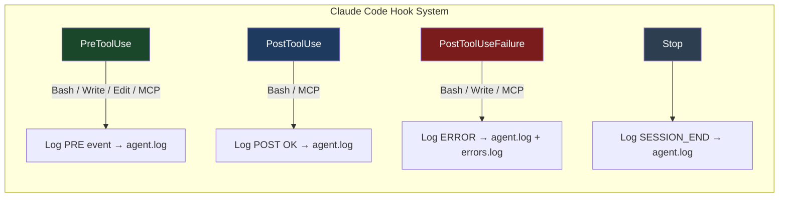
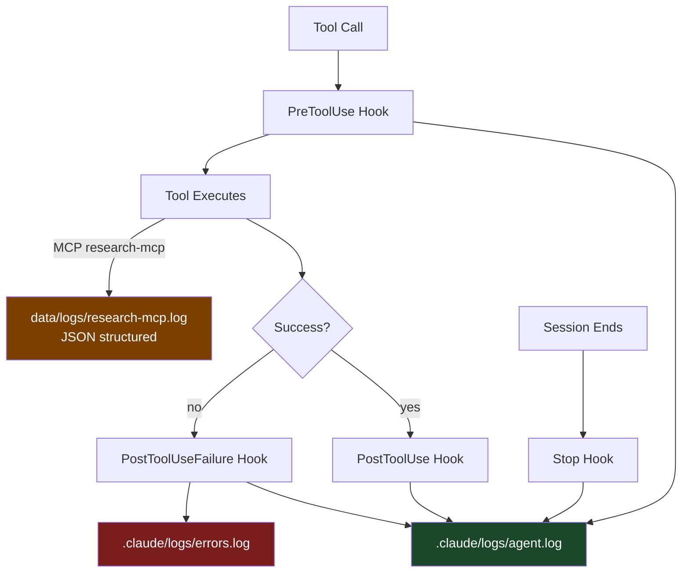

# Logging System

All agent activity is captured at two levels: **hook-level** (Claude Code harness) and **application-level** (research-mcp server).

---

## Log Files

| File | Format | Written By | Content |
|------|--------|-----------|---------|
| `.claude/logs/agent.log` | TSV | hooks in settings.json | All tool pre/post events |
| `.claude/logs/errors.log` | TSV | PostToolUseFailure hooks | Failed tool calls |
| `.claude/logs/deploy-history.log` | TSV | `/deploy-check` command | Deploy gate results |
| `data/logs/research-mcp.log` | JSON (newline-delimited) | research-mcp server | MCP tool invocations |
| `.claude/session-notes.md` | Markdown | hooks + agent commands | Human-readable session log |

---

## Hook Architecture



---

## agent.log Format

Tab-separated values, one event per line:

```
<ISO-8601 timestamp>  <PHASE>  <TOOL>  <DETAIL>
```

| Column | Values | Description |
|--------|--------|-------------|
| timestamp | `2026-05-12T14:30:00Z` | UTC ISO-8601 |
| phase | `PRE`, `POST`, `ERROR`, `SESSION_END` | Lifecycle phase |
| tool | `Bash`, `Write`, `Edit`, `MCP-research`, `SESSION_END` | Tool or event type |
| detail | command / file path / status / message | Tool-specific context |

**Example lines:**
```
2026-05-12T14:30:01Z	PRE	Bash	git status
2026-05-12T14:30:01Z	POST	Bash	OK
2026-05-12T14:30:05Z	PRE	Write	docs/ARCHITECTURE.md
2026-05-12T14:30:05Z	PRE	MCP-research	fetch_arxiv
2026-05-12T14:30:07Z	POST	MCP-research	OK
2026-05-12T14:35:00Z	SESSION_END	Claude session finished
```

---

## research-mcp.log Format

Newline-delimited JSON (one JSON object per line):

```json
{"ts":"2026-05-12T14:30:05.123Z","level":"info","message":"Tool invoked: fetch_arxiv","args":{"query":"transformer attention","max_results":10}}
{"ts":"2026-05-12T14:30:06.456Z","level":"info","message":"arXiv results fetched","query":"transformer attention","count":10}
{"ts":"2026-05-12T14:30:06.789Z","level":"info","message":"Tool completed: fetch_arxiv","durationMs":1666}
```

### Log Levels

| Level | Numeric | Use |
|-------|---------|-----|
| `debug` | 0 | Verbose: URLs, raw params |
| `info` | 1 | Normal operations (default) |
| `warn` | 2 | Degraded but non-fatal |
| `error` | 3 | Failures with stack traces |

Set via `LOG_LEVEL` env var in `settings.json` → `mcpServers.research-mcp.env`.

---

## Data Flow



---

## Querying Logs

```bash
# Last 50 errors
tail -50 .claude/logs/errors.log

# All research-mcp errors today
grep '"level":"error"' data/logs/research-mcp.log | jq 'select(.ts | startswith("2026-05-12"))'

# Deploy history — failures only
grep DEPLOY_FAIL .claude/logs/deploy-history.log

# Tool timing from research-mcp
grep 'Tool completed' data/logs/research-mcp.log | jq '{tool: .message, ms: .durationMs}'

# Session boundaries
grep SESSION_END .claude/logs/agent.log
```
