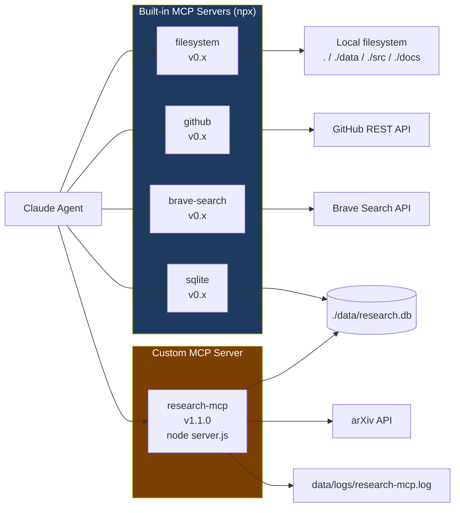
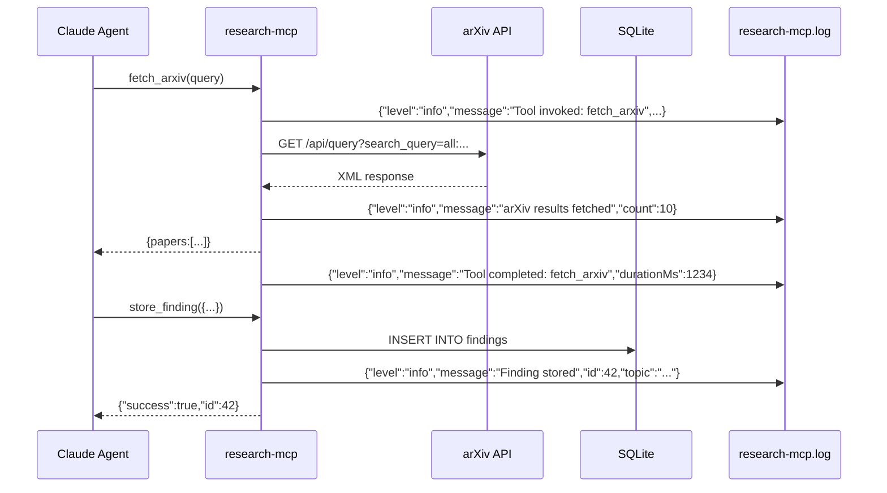

# MCP Servers Reference

## Server Overview



---

## Built-in Servers

### `filesystem`

Scoped read/write access to project directories.

**Allowed paths:** `.` (root), `./data`, `./src`, `./docs`

**Key tools:** `read_file`, `write_file`, `list_directory`, `create_directory`, `move_file`, `search_files`

---

### `github`

GitHub API integration. Requires `GITHUB_TOKEN` environment variable.

**Key tools:** `search_code`, `create_issue`, `create_pull_request`, `list_issues`, `get_file_contents`, `push_files`

---

### `brave-search`

Real-time web search. Requires `BRAVE_API_KEY` environment variable.

**Key tools:** `brave_web_search`

**Usage in agents:** Primary web search source for `/research`. Falls back to `WebSearch` tool if unavailable.

---

### `sqlite`

Direct SQL access to `./data/research.db`.

**Key tools:** `query`, `execute` (DDL/DML)

**Schema managed by:** `research-mcp` server (creates tables on startup).

---

## Custom Server: `research-mcp`

**File:** `mcp-servers/research-mcp/server.js`
**Version:** 1.1.0
**Transport:** stdio

### Tool Reference

#### `fetch_arxiv`

Query the arXiv API and return structured paper metadata.

| Parameter | Type | Required | Default | Description |
|-----------|------|----------|---------|-------------|
| `query` | string | yes | — | Search query (e.g. `"transformer attention mechanism"`) |
| `max_results` | number | no | 10 | Max papers returned (capped at 50) |

**Returns:**
```json
{
  "query": "transformer attention",
  "count": 10,
  "papers": [
    {
      "id": "2305.12345",
      "title": "...",
      "authors": "Author A, Author B",
      "abstract": "...",
      "published": "2023-05-15",
      "url": "https://arxiv.org/abs/2305.12345",
      "pdfUrl": "https://arxiv.org/pdf/2305.12345"
    }
  ]
}
```

---

#### `summarize_paper`

Heuristic extraction of contribution, methods, and results from an abstract.

| Parameter | Type | Required |
|-----------|------|----------|
| `title` | string | yes |
| `abstract` | string | yes |
| `authors` | string | no |
| `published` | string | no |
| `url` | string | no |

**Returns:**
```json
{
  "title": "...",
  "authors": "...",
  "published": "2023-05-15",
  "contribution": "We propose...",
  "methods": "Our model uses...",
  "results": "We achieve state-of-the-art...",
  "oneLineSummary": "We propose... Our model uses..."
}
```

---

#### `store_finding`

Persist a research finding to SQLite.

| Parameter | Type | Required | Default |
|-----------|------|----------|---------|
| `topic` | string | yes | — |
| `title` | string | yes | — |
| `summary` | string | yes | — |
| `source_type` | enum: `arxiv\|web\|book\|other` | no | `arxiv` |
| `url` | string | no | null |
| `authors` | string | no | null |
| `relevance` | number (0–10) | no | 5.0 |
| `tags` | string (comma-separated) | no | null |

**Returns:** `{"success": true, "id": <rowid>}`

---

#### `list_findings`

Retrieve stored findings, optionally filtered by topic.

| Parameter | Type | Default | Description |
|-----------|------|---------|-------------|
| `topic` | string | `%` | Topic filter (supports `%` wildcard) |
| `limit` | number | 20 | Max rows returned |

**Returns:** `{"count": N, "findings": [...]}`

---

### research-mcp Logging

The server logs all activity to `data/logs/research-mcp.log` in newline-delimited JSON.



### Environment Variables

| Variable | Default | Description |
|----------|---------|-------------|
| `ARXIV_BASE_URL` | `https://export.arxiv.org/api/query` | arXiv API base URL |
| `MAX_RESULTS` | `20` | Default max papers per query |
| `DB_PATH` | `../../data/research.db` | SQLite database path |
| `LOG_FILE` | `../../data/logs/research-mcp.log` | Log file path |
| `LOG_LEVEL` | `info` | Min log level: `debug\|info\|warn\|error` |
