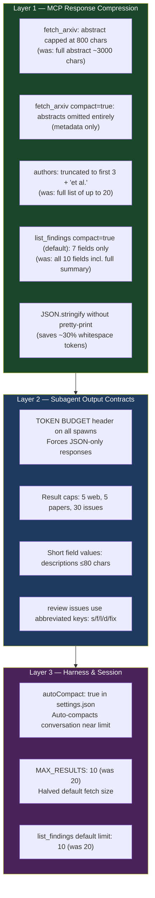
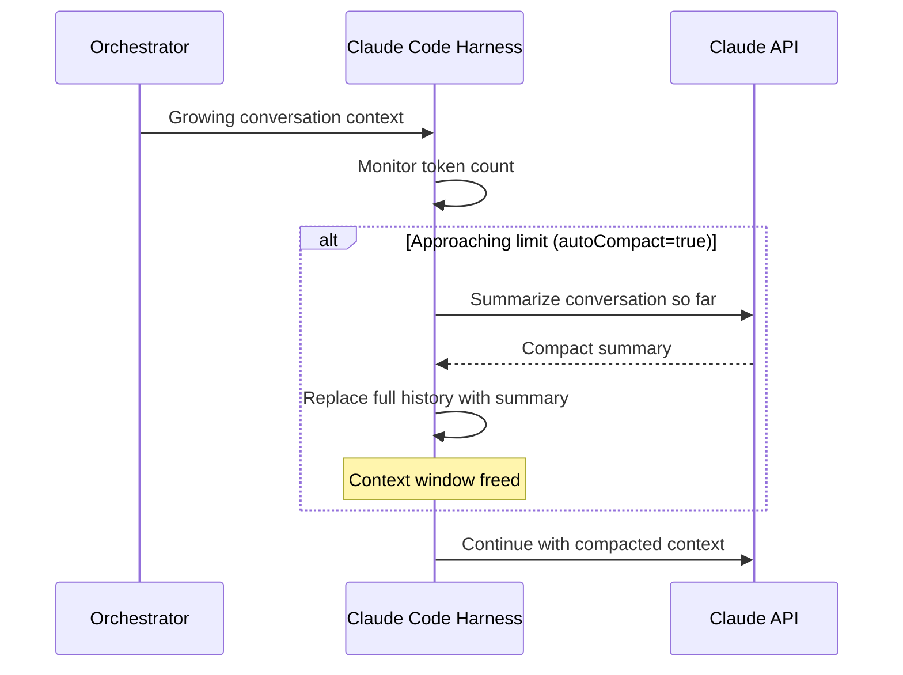

# Token Budget & Context Compression

## Why This Matters

Every token sent to and from the Claude API counts against:
- **Context window** — hitting the limit causes auto-compaction or errors
- **Plan quota** — tokens cost money / plan credits
- **Latency** — larger payloads = slower round-trips

This document describes every compression measure implemented in this project.

---

## Compression Layers



---

## Token Savings Estimate

| Operation | Before | After | Saving |
|-----------|--------|-------|--------|
| `fetch_arxiv` (10 papers, full) | ~35,000 chars | ~10,000 chars | **~71%** |
| `fetch_arxiv` (compact=true) | ~35,000 chars | ~2,500 chars | **~93%** |
| `list_findings` (20 rows, full) | ~15,000 chars | ~3,000 chars | **~80%** |
| Subagent review response | ~8,000 chars prose | ~3,000 chars JSON | **~62%** |
| Subagent research response | ~12,000 chars prose | ~2,000 chars JSON | **~83%** |

Approximate total per `/research` call: **~60,000 → ~15,000 chars** (~75% reduction)

---

## Configuration Knobs

All tunable via `settings.json` → `mcpServers.research-mcp.env`:

| Env Var | Default | Effect |
|---------|---------|--------|
| `ABSTRACT_MAX_CHARS` | `800` | Hard cap on abstract length in `fetch_arxiv` response |
| `MAX_RESULTS` | `10` | Default number of arXiv papers fetched per query |
| `LOG_LEVEL` | `info` | Set to `warn` to reduce log I/O (minor) |

---

## Tool Usage Patterns

### Recommended: Two-Phase arXiv Search

Fetch compact first → summarize only papers of interest:

```
# Phase 1 — cheap: metadata only
fetch_arxiv(query="transformers", max_results=10, compact=true)
# → 2,500 chars, pick top 3 by title relevance

# Phase 2 — targeted: get summaries for selected papers only
summarize_paper(paper_1)
summarize_paper(paper_2)
summarize_paper(paper_3)
# → ~600 chars × 3 = 1,800 chars total
```

**vs. naive approach** (fetch all with abstracts + summarize all 10):
`35,000 + 6,000 = 41,000 chars` → **Two-phase saves ~90%**

### Recommended: list_findings Before Fetching New Data

Always check the DB first to avoid redundant API calls:

```
list_findings(topic="transformers", compact=true, limit=5)
# → check if we already have relevant findings
# Only fetch from arXiv if cache miss
```

---

## Auto-Compaction

`autoCompact: true` in `settings.json` instructs Claude Code to automatically compact the conversation context when it approaches the model's context window limit.



**Do not fight auto-compaction** — it preserves task state in a summary. If you need a specific piece of context after compaction, re-read it from files (logs, DB) rather than relying on conversation history.

---

## Subagent Token Contract

Every subagent spawn must include this header:

```
TOKEN BUDGET: Return only JSON. No prose before or after.
Cap: [N results / N issues / N findings].
Field values ≤ [X] chars each.
```

This is enforced in all `.claude/commands/*.md` files. Do not remove it.
