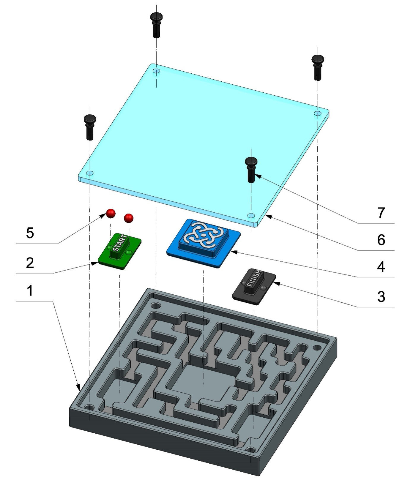
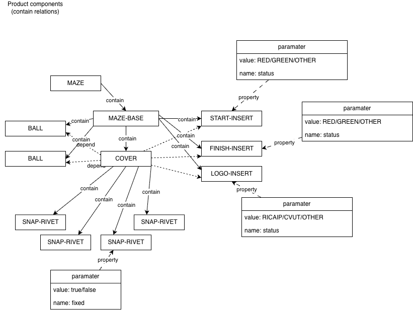

# RICAIP MAZE

There is product maze, which is a physical maze used for testing and demonstration purposes. The maze is designed to be modular and can be reconfigured in various ways to create different layouts and challenges.

There are two size variants of the maze: MazeBase_106 and MazeBase_85. The MazeBase_106 is larger and can accommodate more complex layouts, while the MazeBase_85 is smaller and more compact.

## Product Details

| Number | Identificator | Quantity | Name | Origin |
|--------|---------------|----------|------|--------|
| 1 | 1001 | 1 | MAZE-BASE_106 | Manufactured item |
| 2 | 1002 | 1 | START-INSERT_106 | Manufactured item |
| 3 | 1003 | 1 | FINISH-INSERT_106 | Manufactured item |
| 4 | 1004 | 1 | LOGO-INSERT_106_RICAIP | Manufactured item |
| 5 | 1005 | 2 | BALL_106 | Purchased item |
| 6 | 1006 | 1 | COVER_106 | Purchased item |
| 7 | 1007 | 4 | SNAP-RIVET_106 | Purchased item |

## Bill of Materials (BOM)

There are three component types in the maze product: Product, SemiFinished, and Material. The Product type represents the final assembled maze, while the SemiFinished type represents components that are manufactured but not yet assembled. The Material type represents raw materials or purchased items that are used in the manufacturing process.

| Type |
|---|
| Material |
| SemiFinished |
| Product |

There are also product codes that group components into different categories based on their function or assembly. The codes are as follows:

| ID | Code | Components |
|---|---|---|
| 100 | MACHINNING | 1001,1005,2001,2005 |
| 200 | 3D-PRINT | 1002,1003,1004,2002,2003,2004 |
| 500 | ASSEMBLY | 1000,2000 |
| 600 | STOCKING | ALL COMPONENTS |

### Maze 85x85
| ID | Code | Name | Type | Qty | Supplier code | Description |
|---|---|---|---|---|---|---|
| 2000 | MAZE_85 | Maze 85x85 | Product | 1 | | |
| 2002 | START-INSERT_85 | Start insert 3D print plastic | SemiFinis | 1 | | |
| 2003 | FINISH-INSERT_85 | Finish insert 3D print plastic | SemiFinis | 1 | | |
| 2006 | BALL_85 | Ball | Material | 2 | | |
| 2005 | COVER_85 | Plastics transparent cover | SemiFinis | 1 | | |
| 2001 | MAZE-BASE_85 | Base part of maze | SemiFinis | 1 | | |
| 2007 | SNAP-RIVET_85 | Snap Rivet WA-EXRV | Material | 4 | | Snap rivet |
| 2004 | LOGO-INSERT_85-RICAIP | Central insert logo 3D printed | SemiFinis | 1 | | |

### Maze 106x106
| ID | Code | Name | Type | Qty | Supplier code | Description |
|---|---|---|---|---|---|---|
| 1000 | MAZE_106 | Maze 106x106 | Product | 1 | | |
| 1002 | START-INSERT_106 | Start insert 3D print plastic | SemiFinis | 1 | | |
| 1003 | FINISH-INSERT_106 | Finish insert 3D print plastic | SemiFinis | 1 | | |
| 1006 | BALL_106 | Ball | Material | 2 | | |
| 1005 | COVER_106 | Plastics transparent cover | SemiFinis | 1 | | |
| 1001 | MAZE-BASE_106 | Base part of maze | SemiFinis | 1 | | |
| 1007 | SNAP-RIVET_106 | Snap Rivet WA-EXRV | Material | 4 | WA-EXRV 7009747600 | Snap rivet 4x10 |
| 1004 | LOGO-INSERT_106-RICAIP | Central insert logo 3D printed | SemiFinis | 1 | | |	

## Product Semantics

The maze product is designed to be modular and customizable, allowing for different configurations and layouts. The base of the maze (MAZE-BASE) serves as the foundation for the assembly, while the start and finish inserts (START-INSERT and FINISH-INSERT) provide designated areas for the beginning and end of the maze. The logo insert (LOGO-INSERT) adds branding and visual appeal to the product. The ball (BALL) is a key component that interacts with the maze, and the cover (COVER) provides protection and visibility for the internal components. The snap rivets (SNAP-RIVET) are used to securely fasten the components together during assembly. Overall, the maze product is designed to be a versatile and engaging tool for testing and demonstration purposes, with a focus on modularity and ease of assembly.

This semantic diagram illustrates the relationships between the different components of the maze product. The MAZE_106 and MAZE_85 are the final products that are assembled using the various components. The START-INSERT, FINISH-INSERT, LOGO-INSERT, BALL, COVER, and SNAP-RIVET components are all used in the assembly process to create the final maze product. Each component has a specific role in the overall design and functionality of the maze, contributing to its modularity and versatility.

Semantic description:
- contain - the source component contains the target component as part of its structure or assembly
- depend - the source component relies on the target component for its functionality or operation
- property - the component has a specific attribute parameter or characteristic that defines its behavior or appearance