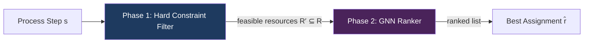
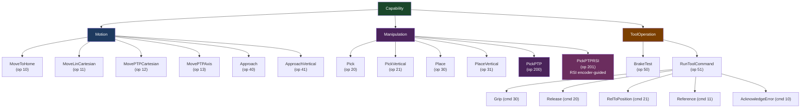
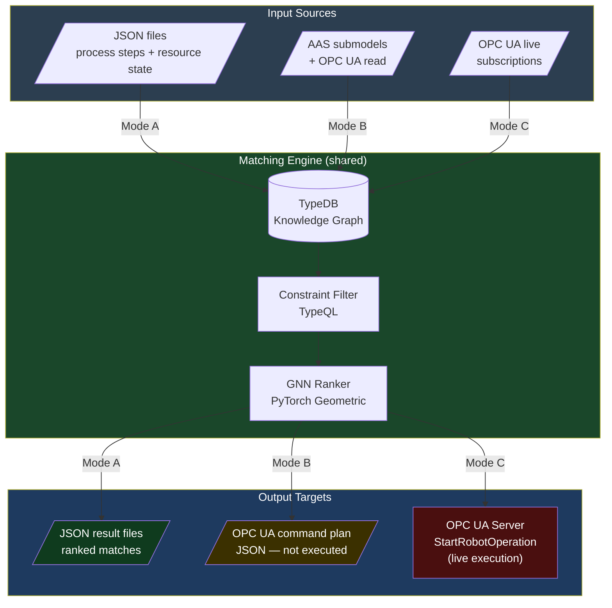
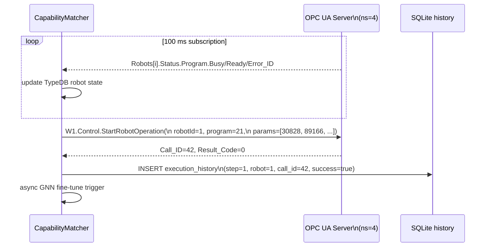
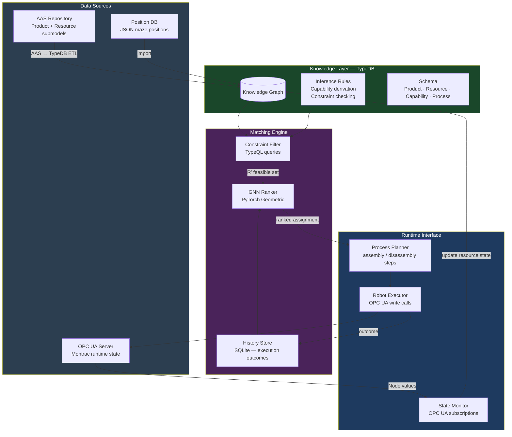
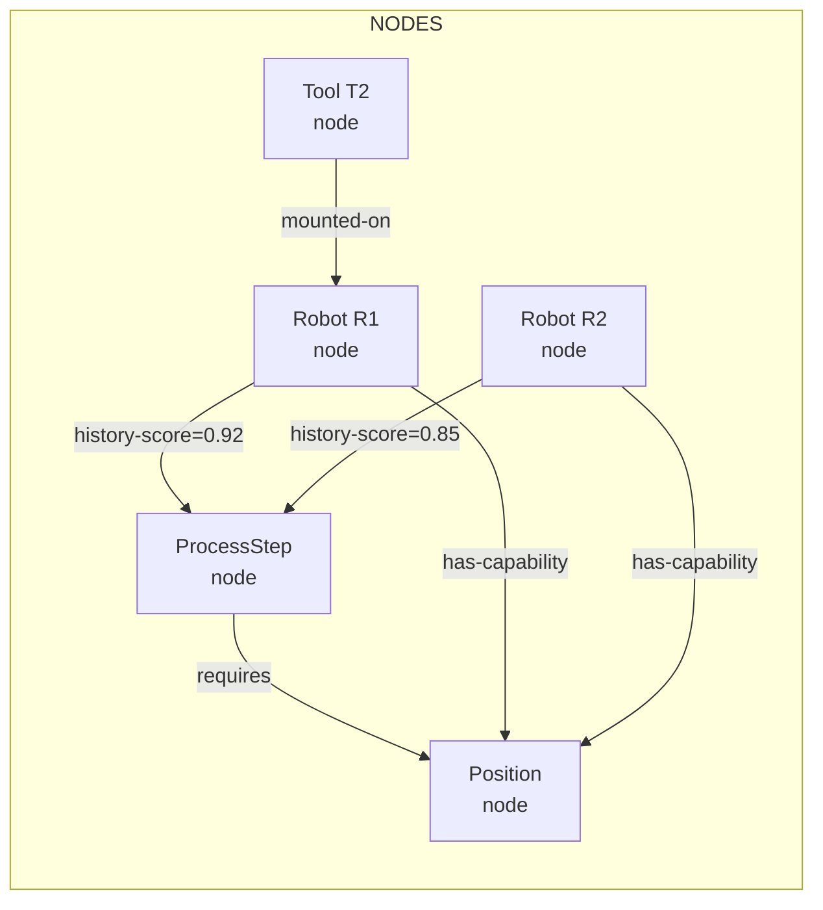
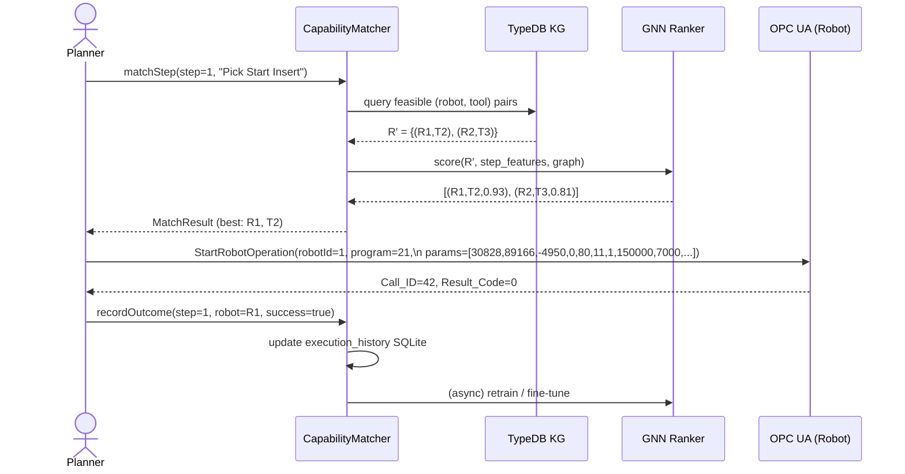
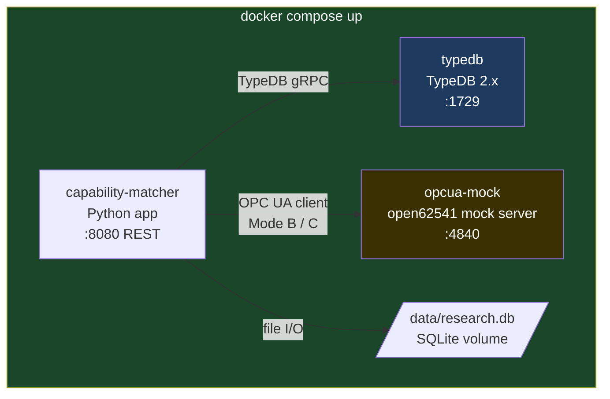

# Capability Matching for Assembly and Disassembly in Manufacturing

## Thesis Abstract

The aim of the thesis is to design, implement, and experimentally evaluate a hybrid capability-matching system for assembly and disassembly processes in manufacturing. The system will combine reasoning over a formal semantic model with graph-neural evaluation of capability suitability. The solution will use Asset Administration Shell (AAS) as a source of structured semantic data, TypeDB as the ontology and reasoning layer, and OPC UA runtime data to reflect the current state of production resources. The proposed method will be validated on representative assembly and disassembly scenarios and compared with a rule-based baseline.

### Thesis Goals

1. Analyze related approaches and technologies relevant to the thesis, especially AAS, industrial ontologies and knowledge graphs, graph neural networks, and OPC UA/MQTT communication in manufacturing systems.
2. Design a formal semantic model of products, manufacturing resources, capabilities, constraints, and runtime production-line state for assembly and disassembly processes and implement this model in a knowledge-graph framework.
3. Implement data integration from AAS and runtime sources, including transformation of selected AAS submodels into the knowledge graph and incorporation of OPC UA data into the decision-making process.
4. Develop a hybrid capability-matching method that combines filtering based on logical constraints and precondition verification with graph-neural ranking of feasible capabilities according to expected suitability and probability of successful execution.
5. Experimentally evaluate the proposed solution on selected manufacturing assembly and disassembly use cases, compare it with a rule-based baseline, and assess its performance using measurable criteria such as matching accuracy, ranking quality, latency, and scalability.

---

## 1. Use Case: RICAIP Maze Assembly on the Montrac Line

### 1.1 Product Description

The **RICAIP Maze** is a physical demonstration product used in the RICAIP testbed. It is a modular ball maze assembled from machined, 3D-printed, and purchased components. Two size variants exist:

| Variant | ID | Base dimensions |
|---------|-----|----------------|
| Maze 106 | MAZE_106 | 106 × 106 mm |
| Maze 85 | MAZE_85 | 85 × 85 mm |

**Bill of Materials (Maze 106):**

| Part ID | Name | Type | Qty |
|---------|------|------|-----|
| 1001 | MAZE-BASE_106 | SemiFinished (machined) | 1 |
| 1002 | START-INSERT_106 | SemiFinished (3D-printed) | 1 |
| 1003 | FINISH-INSERT_106 | SemiFinished (3D-printed) | 1 |
| 1004 | LOGO-INSERT_106-RICAIP | SemiFinished (3D-printed) | 1 |
| 1005 | COVER_106 | SemiFinished (purchased) | 1 |
| 1006 | BALL_106 | Material (purchased) | 2 |
| 1007 | SNAP-RIVET_106 (WA-EXRV) | Material (purchased) | 4 |

### 1.2 Assembly Process

The assembly consists of **10 ordered steps** executed by robots on the Montrac conveyor station:

| Step | Operation | Robot Op (V4) | Description |
|------|-----------|---------------|-------------|
| 1 | Pick Start Insert | 21 (Pick Vertical) | Pick START-INSERT from storage |
| 2 | Place Start Insert | 31 (Place Vertical) | Place into MAZE-BASE |
| 3 | Pick Finish Insert | 21 | Pick FINISH-INSERT from storage |
| 4 | Place Finish Insert | 31 | Place into MAZE-BASE |
| 5 | Pick Logo Insert | 21 | Pick LOGO-INSERT from storage |
| 6 | Place Logo Insert | 31 | Place into MAZE-BASE |
| 7 | Insert Ball | 41 (Approach Vertical) | Drop BALL_106 into channel |
| 8 | Pick Cover | 21 | Pick COVER_106 from storage |
| 9 | Place Cover | 31 | Place cover onto maze |
| 10 | Insert Rivets (×4) | 41 | Press 4 SNAP-RIVETs to fasten cover |

**Disassembly** reverses steps 10 → 1, requiring the same robot resources with additional precondition: cover must be accessible (rivets removed before cover can be lifted).

### 1.3 Physical Resources

**Robots** — Three KUKA Agilus 2 6-DOF industrial robots:

| ID | Model | Role |
|----|-------|------|
| R1 | Agilus 2 | Primary assembly robot |
| R2 | Agilus 2 | Secondary / parallel |
| R3 | Agilus 2 | Secondary / parallel |

All robots support the full V4 operation set (IDs: 10, 11, 12, 13, 20, 21, 30, 31, 40, 41, 50, 51, 200, 201).

**Grippers / Tools:**

| ID | Model | Type | Grip/Release? |
|----|-------|------|---------------|
| T1 | — | Calibration needle | No |
| T2 | EGI-40 | Electric finger | Yes |
| T3 | EGL-90 | Electric finger | Yes |
| T7 | EGL-90 | Electric finger | Yes |
| T8 | PGN+P100-1 | Pneumatic finger | Yes |
| T9 | PGN+P100-1 | Pneumatic finger | Yes |
| T12 | PGN+P64-1 | Pneumatic finger | Yes |
| T16 | EGI-80 | Electric finger | Yes |

Tool–operation compatibility:
- **Grip / Release**: T2, T3, T7, T8, T9, T12, T16
- **Reference / Acknowledge Error**: T2, T3, T7, T16 (electric only)

**Position constraints** (example — `maze_106_pick_insert_start`):
- Valid robots: R1
- Valid bases: 11, 12, 13, 21, 22, 23
- Valid tool: T2 (open\_position = 7000)
- Position: X=30.83, Y=89.17, Z=−4.95 mm, C=−180°

### 1.4 Robot Operation Set (V4)

The authoritative operation set is defined in *Montrac-Robot-Operation-Description-V4.pdf* (2026-02-03). All coordinate parameters use **micrometers** (µm) for linear axes and **millidegrees** (m°) for angular axes. Speed is 1–100 (percentage).

| ID | Name | Key Parameters | Notes |
|----|------|---------------|-------|
| 10 | MOVE TO HOME | Speed | Returns all joints to home |
| 11 | MOVE LIN CARTESIAN | X, Y, Z (µm), A, B, C (m°), Speed, Base ID | Linear interpolated move |
| 12 | MOVE PTP CARTESIAN | X, Y, Z (µm), A, B, C (m°), Status (0–7), Turn (0–63), Speed, Base ID | PTP Cartesian move |
| 13 | MOVE PTP AXIS | A1–A6 (m°), Speed | PTP joint-space move |
| 20 | PICK | X, Y, Z (µm), A, B, C (m°), Speed, Base ID, Return, Offset (100k–500k µm), Gripper Open Position (±100k µm) | Full 6-DOF pick with approach |
| 21 | PICK VERTICAL | X, Y, Z (µm), A (m°), Speed, Base ID, Return, Offset, Gripper Open Position | Vertical-only approach (B=C fixed) |
| 30 | PLACE | X, Y, Z (µm), A, B, C (m°), Speed, Base ID, Return, Offset, Gripper Open Position | Full 6-DOF place with retract |
| 31 | PLACE VERTICAL | X, Y, Z (µm), A (m°), Speed, Base ID, Return, Offset, Gripper Open Position | Vertical-only retract |
| 40 | APPROACH | X, Y, Z (µm), A, B, C (m°), Speed, Base ID, Return, Offset | Move to position without gripper action |
| 41 | APPROACH VERTICAL | X, Y, Z (µm), A (m°), Speed, Base ID, Return, Offset | Vertical approach without gripper action |
| 50 | BRAKE TEST | — | Validates axis brake integrity |
| 51 | RUN TOOL COMMAND | Gripper Command (1–1000), Gripper Command Parameter | Execute gripper sub-command (see below) |
| 200 | PICK PTP | A1–A6 (m°), Speed, Offset | Pre-pick joint move; Base ID hardcoded to 1 |
| 201 | PICK PTP RSI | A1–A6 (m°), Speed, Offset, Encoder Captured Position (dm-mm) | RSI-corrected pick using KUKA encoder feedback |

**Gripper sub-commands (op 51):**

| Code | Name | Description |
|------|------|-------------|
| 10 | Acknowledge Error | Clear gripper fault state |
| 11 | Reference | Execute gripper referencing stroke |
| 20 | Release | Open gripper fully |
| 21 | Release to Position | Open gripper to a specified position (µm) |
| 30 | Grip | Close gripper (grip object) |

#### Parameter_Array Encoding (selected operations)

`StartRobotOperation` passes all parameters via `Parameter_Array[1..20]` (Int32). Units: µm for positions, m° for angles.

| Parameter_Array index | Op 21 (PICK VERTICAL) | Op 31 (PLACE VERTICAL) | Op 41 (APPROACH VERTICAL) | Op 200 (PICK PTP) | Op 201 (PICK PTP RSI) |
|----------------------|----------------------|----------------------|--------------------------|-------------------|-----------------------|
| [1] | X (µm) | X (µm) | X (µm) | A1 (m°) | A1 (m°) |
| [2] | Y (µm) | Y (µm) | Y (µm) | A2 (m°) | A2 (m°) |
| [3] | Z (µm) | Z (µm) | Z (µm) | A3 (m°) | A3 (m°) |
| [4] | A (m°) | A (m°) | A (m°) | A4 (m°) | A4 (m°) |
| [5] | Speed | Speed | Speed | A5 (m°) | A5 (m°) |
| [6] | Base ID | Base ID | Base ID | A6 (m°) | A6 (m°) |
| [7] | Return | Return | Return | Speed | Speed |
| [8] | Offset (µm) | Offset (µm) | Offset (µm) | Offset (µm) | Offset (µm) |
| [9] | Gripper Open Pos (µm) | Gripper Open Pos (µm) | — | — | Encoder Captured Pos (dm-mm) |

---

## 2. Problem Formulation

### 2.1 Capability Matching

Given:
- A **process step** $s$ with required operation type, target position, and object class
- A set of **manufacturing resources** $R = \{r_1, \ldots, r_n\}$ each with known capabilities, current state, and tool configuration
- A **knowledge graph** $G$ encoding product semantics, resource capabilities, and runtime state

Find: a ranked list of feasible resource assignments $\hat{r} \in R$ that can execute $s$, ordered by expected success probability.

The matching problem decomposes into two phases:



**Phase 1 — Hard constraint filtering** eliminates resources that cannot physically execute the step:
- Robot must support the required operation index
- Mounted tool must be compatible with the operation
- Tool open position must accommodate component geometry
- Robot base frame must cover the target position
- Robot must not be busy / in error state (OPC UA runtime check)

**Phase 2 — GNN ranking** scores the remaining candidates:
- Graph encodes: resource–capability–component–position relationships
- Node features: tool type, robot state, historical success rate, current load
- Edge features: capability coverage, geometric compatibility score
- Output: per-resource suitability score ∈ [0, 1]

### 2.2 Capability Model

A **capability** is a typed, parameterized action a resource can perform:

```
Capability {
  type:        CapabilityType          # e.g. PickVertical, PlaceVertical, ApproachVertical
  robot:       Robot
  tool:        Tool
  base_frames: Set[Integer]
  positions:   Set[MazePosition]
  constraints: Set[Constraint]         # tool open range, payload, approach offset bounds
}
```

**CapabilityType hierarchy (V4 operation IDs):**



---

## 3. Three-Mode Execution Architecture

The capability-matching system operates in three distinct modes depending on the deployment context. The core matching engine (TypeDB + GNN) is identical in all modes; only the input/output interfaces change.

### 3.1 Mode Overview

| Mode | Input | Output | OPC UA | Use |
|------|-------|--------|--------|-----|
| **(A) R&D** | JSON files (process steps, resource state) | JSON files (ranked matches) | None | Offline algorithm development, unit testing, training data generation |
| **(B) Planning** | JSON files or AAS | OPC UA command plan (JSON) | Read-only (optional) | Pre-deployment verification, dry-run validation |
| **(C) Real Testing** | OPC UA live state | OPC UA method calls (`StartRobotOperation`) | Read + Write | Full testbed execution |



### 3.2 Mode A — R&D (File-Based)

All inputs and outputs are JSON files; no OPC UA connection is required. This mode supports:
- **Offline algorithm development**: run matching experiments without hardware
- **Unit testing**: deterministic inputs allow reproducible test cases
- **Training data generation**: inject synthetic resource-state scenarios

**Input files:**
```json
{
  "process_steps": [{"step": 1, "op": 21, "component": "START-INSERT_106", ...}],
  "resource_state": [{"robot_id": 1, "enabled": true, "busy": false, "tool_id": 2, ...}],
  "positions": ["maze_106_pick_insert_start", ...]
}
```

**Output file:**
```json
{
  "step": 1,
  "ranked_matches": [
    {"robot": 1, "tool": 2, "score": 0.93, "violations": []},
    {"robot": 2, "tool": 3, "score": 0.81, "violations": []}
  ]
}
```

### 3.3 Mode B — Planning (OPC UA Dry-Run)

The engine reads current OPC UA state (optional) to produce a validated command plan without executing it. The plan is a JSON document that maps each process step to an OPC UA `StartRobotOperation` call — parameters pre-encoded per V4 `Parameter_Array` layout.

**Output command plan (excerpt):**
```json
{
  "plan_id": "maze_106_assembly_2026-05-12T10:00:00",
  "mode": "planning",
  "steps": [
    {
      "step": 1,
      "robot_id": 1,
      "program_number": 21,
      "parameter_array": [30828, 89166, -4950, 0, 80, 11, 1, 150000, 7000, 0, ...]
    }
  ]
}
```

The plan can be reviewed, modified, and then promoted to Mode C for execution.

### 3.4 Mode C — Real Testing (OPC UA Execution)

The matching engine is connected to the live Montrac OPC UA server. State is read via subscriptions (100 ms interval); assignments are executed via `StartRobotOperation` method calls. Execution outcomes (Result_Code, Result_Array) are written back to the `execution_history` SQLite table to feed GNN retraining.



---

## 4. System Architecture



---

## 5. Semantic Model

### 5.1 TypeDB Schema Sketch

```
# Entity types
entity Product         sub entity, owns id, owns name, owns type;
entity Component       sub entity, owns part-id, owns part-code, owns qty;
entity Robot           sub entity, owns robot-id, owns model, owns state;
entity Tool            sub entity, owns tool-id, owns tool-type, owns model;
entity MazePosition    sub entity, owns position-name, owns x, owns y, owns z;
entity Capability      sub entity, owns capability-type, owns op-index;
entity ProcessStep     sub entity, owns step-index, owns step-name, owns op-index;

# Relation types
relation has-component  relates product, relates component;
relation mounted-on     relates tool, relates robot;
relation covers-pos     relates capability, relates maze-position;
relation requires       relates process-step, relates capability;
relation executed-by    relates process-step, relates robot;
```

### 5.2 Constraint Examples

| Constraint | Formal expression |
|------------|-------------------|
| Tool must support operation | `∃ Capability(tool=t, op=op_index)` |
| Robot must be idle | `Robot.state = IDLE` (OPC UA NodeId: `ns=2;s=R{i}.State`) |
| Tool open position in range | `tool.open_position ∈ [min, max]` per position JSON |
| Base frame reachable | `base_id ∈ position.valid_bases` for robot |
| Assembly order respected | `step.preconditions ⊆ completed_steps` |

### 5.3 Runtime State Integration via OPC UA

The OPC UA server is a **Siemens S7-1500 PLC** (`urn:SIMATIC.S7-1500.OPC-UAServer:=Name.PLC15xx`) with the factory namespace `http://prague.ti40.cz/factory/` at index `ns=4`. All production-relevant nodes live under `Root.Objects.W1`.

#### Address Space Structure

```mermaid
graph TD
    W1[W1 Workcell root] --> CTRL[Control\nMethods]
    W1 --> STATUS[Status\nSafety flags]
    W1 --> ROBOTS[Robots\nRobots[0..4]]
    W1 --> MONTRAC[Montrac\nConveyor system]

    ROBOTS --> R0[Robots[0]\nRobot 1 / R1]
    ROBOTS --> R1[Robots[1]\nRobot 2 / R2]
    ROBOTS --> R2[Robots[2]\nRobot 3 / R3]

    R0 --> R0S[Status]
    R0 --> R0T[Tool\nAttached tool]
    R0 --> R0TC[Toolchangers[1..4]\nTool rack slots]

    MONTRAC --> MC[Control\nSendShuttle\nToggleStationLock]
    MONTRAC --> MS[Status\nmontracSystemRunning]
    MONTRAC --> MR[routers[0..3]\nConveyor segments]
    MR --> MOD[modules[1..N]\nConveyor modules]
    MOD --> ST[stations[0..6]\nWork stations]
    MOD --> SH[shuttles[0..10]\nTransport carriers]

    style W1 fill:#2c3e50,color:#fff
    style ROBOTS fill:#1a472a,color:#fff
    style MONTRAC fill:#1e3a5f,color:#fff
```

#### Robot Status Nodes (per robot `Robots[i]`)

| OPC UA NodeId | Browse Name | Type | Description |
|--------------|------------|------|-------------|
| `ns=4;s=Root.Objects.W1.Robots.Robots[i]` | `Robots[i]` | `TYPE_OPCUA_Robot_1` | Root robot object |
| `ns=4;s=...Robots[i].Enabled` | `Enabled` | `Boolean` | Robot enabled flag |
| `ns=4;s=...Robots[i].Status.ID` | `ID` | `UInt32` | Robot ID |
| `ns=4;s=...Robots[i].Status.Mode` | `Mode` | `Byte` | Operating mode |
| `ns=4;s=...Robots[i].Status.In_Home` | `In_Home` | `Boolean` | Robot at home position |
| `ns=4;s=...Robots[i].Status.In_Standstill` | `In_Standstill` | `Boolean` | Robot not moving |
| `ns=4;s=...Robots[i].Status.Manually_Disabled` | `Manually_Disabled` | `Boolean` | Manually disabled flag |
| `ns=4;s=...Robots[i].Status.Error_ID` | `Error_ID` | `UInt32` | Active error code (0 = no error) |
| `ns=4;s=...Robots[i].Status.Base_Frame_ID` | `Base_Frame_ID` | `Int32` | Active base frame index |
| `ns=4;s=...Robots[i].Status.Tool_Frame_ID` | `Tool_Frame_ID` | `Int32` | Active tool frame index |
| `ns=4;s=...Robots[i].Status.TCP_Position` | `TCP_Position` | `TYPE_Robot_Meas_Data` | Current TCP pose (6× Float: X,Y,Z,A,B,C) |
| `ns=4;s=...Robots[i].Status.Flange_Position` | `Flange_Position` | `TYPE_Robot_Meas_Data` | Current flange pose (6× Float) |
| `ns=4;s=...Robots[i].Status.Axis_Angle` | `Axis_Angle` | `TYPE_Robot_Meas_Data` | Joint angles (6× Float) |
| `ns=4;s=...Robots[i].Status.Axis_Current` | `Axis_Current` | `TYPE_Robot_Meas_Data` | Joint currents — load indicator |
| `ns=4;s=...Robots[i].Status.Axis_Temperature` | `Axis_Temperature` | `TYPE_Robot_Meas_Data` | Joint temperatures |

#### Robot Program Execution Nodes

| OPC UA NodeId | Browse Name | Type | Description |
|--------------|------------|------|-------------|
| `ns=4;s=...Robots[i].Status.Program.Busy` | `Busy` | `Boolean` | Program running |
| `ns=4;s=...Robots[i].Status.Program.Done` | `Done` | `Boolean` | Last program completed |
| `ns=4;s=...Robots[i].Status.Program.Error` | `Error` | `Boolean` | Program error flag |
| `ns=4;s=...Robots[i].Status.Program.Ready` | `Ready` | `Boolean` | Ready for new program |
| `ns=4;s=...Robots[i].Status.Program.Program_Data.Program_Number` | `Program_Number` | `UInt32` | Current/last program index |
| `ns=4;s=...Robots[i].Status.Program.Program_Data.Call_ID` | `Call_ID` | `UInt32` | Execution correlation ID |
| `ns=4;s=...Robots[i].Status.Program.Program_Data.Communication_ID` | `Communication_ID` | `String` | Caller identifier |
| `ns=4;s=...Robots[i].Status.Program.Program_Data.Parameter_Array[1..20]` | `Parameter_Array[k]` | `Int32` | Program parameters (op-specific, e.g. position coords) |
| `ns=4;s=...Robots[i].Status.Program.Program_Data.Result_Code` | `Result_Code` | `UInt32` | Execution result code |
| `ns=4;s=...Robots[i].Status.Program.Program_Data.Result_Array[1..20]` | `Result_Array[k]` | `Int32` | Execution result data |

#### Tool and Toolchanger Nodes

| OPC UA NodeId | Browse Name | Type | Description |
|--------------|------------|------|-------------|
| `ns=4;s=...Robots[i].Tool.Status.Attached` | `Attached` | `Boolean` | Tool currently attached to robot |
| `ns=4;s=...Robots[i].Tool.Status.ID` | `ID` | `Byte` | ID of attached tool |
| `ns=4;s=...Robots[i].Toolchangers.Toolchangers[j].Status.Available` | `Available` | `Boolean` | Rack slot available |
| `ns=4;s=...Robots[i].Toolchangers.Toolchangers[j].Status.Occupied` | `Occupied` | `Boolean` | Tool present in slot |
| `ns=4;s=...Robots[i].Toolchangers.Toolchangers[j].Tool.Status.Attached` | `Attached` | `Boolean` | Tool attached from this slot |
| `ns=4;s=...Robots[i].Toolchangers.Toolchangers[j].Tool.Status.ID` | `ID` | `Byte` | Tool ID in this slot |

#### Control Methods

| OPC UA NodeId | Method | Input args | Output args |
|--------------|--------|-----------|------------|
| `ns=4;s=Root.Objects.W1.Control.StartRobotOperation` | `StartRobotOperation` | Robot ID, Program Number, Parameter_Array[20] | Call_ID, Result_Code |
| `ns=4;s=Root.Objects.W1.Control.ToggleRobot` | `ToggleRobot` | Robot ID, Enable (Bool) | Result_Code |
| `ns=4;s=Root.Objects.W1.Montrac.Control.SendShuttle` | `SendShuttle` | Shuttle ID, Target address | Result_Code |
| `ns=4;s=Root.Objects.W1.Montrac.Control.ToggleStationLock` | `ToggleStationLock` | Station address, Lock (Bool) | Result_Code |

#### Workcell Safety Nodes

| OPC UA NodeId | Type | Description |
|--------------|------|-------------|
| `ns=4;s=Root.Objects.W1.Status.Emergency_Stop_OK` | `Boolean` | E-stop circuit closed (true = safe) |
| `ns=4;s=Root.Objects.W1.Status.Operator_Safety_OK` | `Boolean` | Safety door/scanner OK |
| `ns=4;s=Root.Objects.W1.Montrac.Status.montracSystemRunning` | `Boolean` | Conveyor system operational |

#### Montrac Conveyor Nodes

The conveyor exposes up to 4 routers (`routers[0..3]`), each with multiple modules. Modules that are stations expose:

| Node (relative to module) | Type | Description |
|---------------------------|------|-------------|
| `status.identity.address` | `UInt32` | Module address on conveyor network |
| `status.identity.name` | `String` | Module name |
| `status.isStation` | `Boolean` | True if this module is a work station |
| `status.running` | `Boolean` | Module conveyor belt running |
| `status.pathClear` | `Boolean` | No shuttle blocking the path |
| `status.slotNumber` | `Byte` | Physical slot number |
| `status.type` | `Byte` | Module type code |

Station sub-objects expose `lock`, `lockAfterArrival`, `locked`, `inStation` and shuttle objects expose `shuttleId`, `shuttleTarget`, `shuttleTargetAddress`, `atModule`, `currentModule`.

#### Subscription Strategy for Capability Matching

The state monitor subscribes to the following nodes with **100 ms publishing interval** and triggers a TypeDB update on value change:

```
CAPABILITY-RELEVANT (subscribed):
  Robots[i].Status.In_Home          → Robot.is_at_home
  Robots[i].Status.Manually_Disabled → Robot.disabled
  Robots[i].Status.Error_ID         → Robot.error_id (0 = OK)
  Robots[i].Status.Program.Busy     → Robot.busy
  Robots[i].Status.Program.Ready    → Robot.ready
  Robots[i].Status.Base_Frame_ID    → Robot.active_base_frame
  Robots[i].Status.Tool_Frame_ID    → Robot.active_tool_frame
  Robots[i].Tool.Status.ID          → Robot.mounted_tool_id
  Robots[i].Tool.Status.Attached    → Robot.tool_attached
  Robots[i].Toolchangers[j].Status.Available → Toolchanger[j].available
  Robots[i].Toolchangers[j].Tool.Status.ID   → Toolchanger[j].tool_id
  W1.Status.Emergency_Stop_OK       → Workcell.estop_ok
  Montrac.Status.montracSystemRunning → Conveyor.running
```

A robot is considered **available for assignment** when all of the following hold:
- `Enabled = true`
- `Manually_Disabled = false`
- `Error_ID = 0`
- `Program.Busy = false`
- `Program.Ready = true`
- `W1.Status.Emergency_Stop_OK = true`

---

## 6. Hybrid Matching Method

### 6.1 Phase 1 — TypeQL Constraint Filter

```typeql
# Find all robots capable of PickVertical at maze_106_pick_insert_start
# Runtime state fed from OPC UA subscriptions (ns=4 nodes)
match
  $step isa ProcessStep, has step-name "Pick Plastic Insert - MAZE START";
  $pos  isa MazePosition, has position-name "maze_106_pick_insert_start";
  $cap  isa Capability, has capability-type "PickVertical";

  # OPC UA runtime: robot must be ready (Busy=false, Ready=true, Error_ID=0)
  $robot isa Robot,
    has busy false,
    has ready true,
    has error-id 0,
    has manually-disabled false,
    has enabled true;

  # OPC UA runtime: tool must be attached
  $tool isa Tool, has tool-id $tid;
  (tool: $tool, robot: $robot) isa mounted-on;
  (robot: $robot) isa tool-attached;

  # Position constraints from JSON: valid_tools includes T2, valid_bases include 11/12/13
  (capability: $cap, maze-position: $pos) isa covers-pos;
  (capability: $cap, tool: $tool) isa tool-covers-cap;
  (capability: $cap, robot: $robot) isa robot-covers-cap;

  # Safety: E-stop must be OK
  $wc isa Workcell, has estop-ok true, has conveyor-running true;
get $robot, $tool, $cap;
```

Output: set $R' \subseteq R$ of `(robot, tool)` pairs that pass all hard constraints.

### 6.2 Phase 2 — GNN Ranking

**Graph construction** from TypeDB result:



**Node feature vectors:**

| Node type | Features |
|-----------|---------|
| Robot | state (one-hot), utilization (0–1), error count (normalized) |
| Tool | type (one-hot), last calibration age, grip success rate |
| Position | X, Y, Z (normalized), approach offset range |
| ProcessStep | op\_index (one-hot), component\_class (one-hot) |

**Training signal:** binary outcome of each historical execution (success=1, failure=0), stored in SQLite `execution_history` table.

**Architecture:** Graph Attention Network (GAT) with 2 layers, aggregating neighborhood features to produce per-robot suitability score $\hat{y}_r \in [0,1]$.

### 6.3 Decision Output

```
MatchResult {
  step:           ProcessStep
  ranked_options: [
    { robot: R1, tool: T2, score: 0.93, constraint_violations: [] },
    { robot: R2, tool: T3, score: 0.81, constraint_violations: [] },
  ]
  fallback:       rule_based_assignment  # if GNN unavailable
}
```

---

## 7. Assembly / Disassembly Sequence Flow



---

## 8. Evaluation Plan

### 8.1 Scenarios

| Scenario | Steps | Complexity |
|----------|-------|-----------|
| MAZE_106 Assembly | 10 | baseline |
| MAZE_106 Disassembly | 10 | reverse order, rivet removal first |
| MAZE_85 Assembly | 10 | different geometry / tool constraints |
| Degraded cell (R2 in ERROR) | 10 | resource reduction |
| Wrong tool mounted | 10 | constraint hard fail, re-route |

### 8.2 Metrics

| Metric | Definition |
|--------|-----------|
| Matching accuracy | % steps where top-1 ranked robot == oracle optimal |
| NDCG@3 | Ranking quality of top-3 suggestions |
| Latency P95 | 95th-percentile time from step request to MatchResult |
| Scalability | Matching time vs. number of resources (1–10 robots) |
| Constraint recall | % hard violations correctly filtered before GNN |

### 8.3 Baseline

A deterministic rule-based matcher: selects the first robot in {R1, R2, R3} that passes all hard constraints, no ranking. Compared against the hybrid GNN system on all metrics.

---

## 9. Deployment & Development Setup

The system ships as a set of Docker Compose services for reproducible full-stack runs. For development and unit testing, every component can also be started independently from the terminal.

### 9.1 Service Map



### 9.2 Docker Compose Configuration

`docker-compose.yml` at project root:

```yaml
services:
  typedb:
    image: vaticle/typedb:2.28.0
    ports:
      - "1729:1729"
    volumes:
      - typedb_data:/opt/typedb-all-linux/server/data
    healthcheck:
      test: ["CMD", "typedb", "server", "status"]
      interval: 10s
      retries: 5

  opcua-mock:
    build: ./mock/opcua-mock
    ports:
      - "4840:4840"
    environment:
      - MOCK_CONFIG=./config/montrac_mock.json
    profiles: ["mock"]          # opt-in: not started by default

  capability-matcher:
    build: ./src
    ports:
      - "8080:8080"
    environment:
      - TYPEDB_HOST=typedb
      - TYPEDB_PORT=1729
      - TYPEDB_DB=capability_kg
      - OPCUA_ENDPOINT=opc.tcp://opcua-mock:4840/ricaip
      - MODE=A                  # override with B or C at runtime
      - DATA_DIR=/data
    volumes:
      - ./data:/data
      - ./resources:/resources:ro
    depends_on:
      typedb:
        condition: service_healthy

volumes:
  typedb_data:
```

**Run targets:**

| Goal | Command |
|------|---------|
| Full stack (Mode A, no real OPC UA) | `docker compose up` |
| Include OPC UA mock (Mode B testing) | `docker compose --profile mock up` |
| Mode C (real testbed) | `MODE=C OPCUA_ENDPOINT=opc.tcp://<plc-ip>:4840 docker compose up capability-matcher` |
| Tear down + wipe volumes | `docker compose down -v` |

### 9.3 Local Terminal Development

All components can run locally without Docker. Prerequisites: Python ≥ 3.11, TypeDB installed.

**Start TypeDB locally:**
```bash
typedb server &               # starts on localhost:1729
```

**Create database and load schema:**
```bash
cd src
python -m scripts.init_db     # creates 'capability_kg', loads TypeDB schema
```

**Seed knowledge graph from JSON fixtures:**
```bash
python -m scripts.seed_kg \
  --positions resources/montrac/positions.json \
  --resources resources/montrac/resources.json
```

**Run a single matching query (Mode A — file-based):**
```bash
python -m capability_matcher.cli \
  --mode A \
  --input data/test_steps/step_01_pick_start_insert.json \
  --output /tmp/result.json
```

**Run the REST API server locally:**
```bash
TYPEDB_HOST=localhost MODE=A uvicorn capability_matcher.api:app --reload --port 8080
```

**Run all unit and integration tests:**
```bash
pytest src/tests/ -v                          # unit tests (no TypeDB needed)
pytest src/tests/integration/ -v --typedb     # integration (TypeDB must be running)
```

### 9.4 Environment Variables Reference

| Variable | Default | Description |
|----------|---------|-------------|
| `TYPEDB_HOST` | `localhost` | TypeDB server hostname |
| `TYPEDB_PORT` | `1729` | TypeDB gRPC port |
| `TYPEDB_DB` | `capability_kg` | Database name |
| `OPCUA_ENDPOINT` | `opc.tcp://localhost:4840/ricaip` | OPC UA server URL |
| `MODE` | `A` | Execution mode: `A` (file), `B` (plan), `C` (live) |
| `DATA_DIR` | `./data` | Root for SQLite DB and I/O JSON files |
| `GNN_MODEL_PATH` | `./models/gat_ranker.pt` | Path to trained GNN weights |
| `LOG_LEVEL` | `INFO` | Python logging level |

### 9.5 Development vs. Deployed Differences

| Aspect | Local terminal | Docker Compose |
|--------|---------------|----------------|
| TypeDB | Manual `typedb server` | Managed container with health check |
| OPC UA | Real testbed or none | `opcua-mock` profile |
| Hot reload | `--reload` flag | Not enabled |
| Volumes | Local `./data/` | Named Docker volume `typedb_data` |
| Mode C (live) | Direct `OPCUA_ENDPOINT` env | Override compose env |

---

## 10. Open Questions / Next Steps

### Known / Resolved
- [x] OPC UA address space mapped — `RICAIP_testbed_opc-ua-server.xml` (ns=4, `Root.Objects.W1`)
- [x] Robot availability condition defined: `Enabled ∧ ¬Manually_Disabled ∧ Error_ID=0 ∧ ¬Busy ∧ Ready ∧ E-Stop_OK`
- [x] Tool rack topology known: each robot has 4 toolchanger slots (`Toolchangers[1..4]`)
- [x] Program execution interface: `StartRobotOperation` method with `Parameter_Array[20]` for all operation parameters
- [x] Conveyor routing interface: `SendShuttle` + `ToggleStationLock` methods on `Montrac.Control`
- [x] V4 operation set documented — 14 operations (IDs 10–201), authoritative source: `Montrac-Robot-Operation-Description-V4.pdf` (2026-02-03)
- [x] `Parameter_Array` encoding per operation — index-to-parameter mapping documented for ops 21, 31, 41, 200, 201 (Section 1.4)
- [x] Three-mode architecture defined — Mode A (R&D file-based), Mode B (OPC UA planning/dry-run), Mode C (OPC UA real execution) (Section 3)
- [x] Operation ID corrections applied — V3 op 13 (Approach Vertical) corrected to V4 op 41; op 13 is now axis-space PTP move

### Pending
- [ ] Define AAS submodel structure for `Capability` — align with IDTA Part 2 Capability submodel spec
- [ ] TypeDB schema v1 — entity/relation/attribute definitions (Robot, Tool, Toolchanger, MazePosition, Capability, ProcessStep, Workcell)
- [ ] ETL pipeline: AAS JSON → TypeDB insert transactions
- [ ] OPC UA subscription client — map `ns=4` node changes to TypeDB attribute updates; use `Call_ID` for execution correlation
- [ ] Determine robot index → ID mapping (`Robots[0]` = R1 or R2? — verify from testbed documentation)
- [ ] GNN training dataset: run 100+ manual maze assemblies to seed `execution_history`
- [ ] Baseline: pure TypeQL rule-based matcher (first passing robot wins, no ranking)
- [ ] Benchmark harness: automated scenario runner + metrics collector
- [ ] Disassembly precondition: rivet removal state must be tracked (no OPC UA node — derive from process step completion log)
- [ ] Safety interlock integration: `Operator_Safety_OK` node must gate `StartRobotOperation` calls (Mode C only)
- [ ] Mode B → Mode C promotion workflow: define review gate and authorization mechanism for plan execution
- [ ] PICK PTP RSI (op 201): document `Encoder Captured Position` source — which OPC UA node or sensor provides this value

---

*Document status: Working draft — 2026-05-12*
