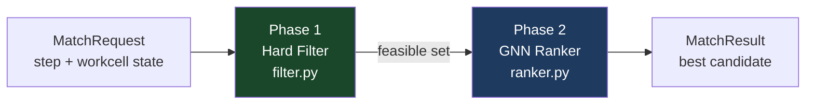
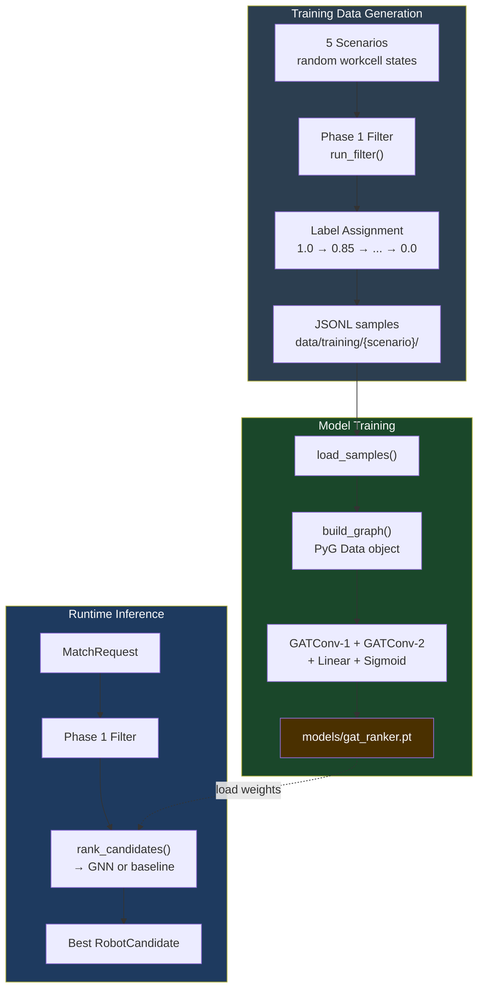

# GNN Ranker — Design, Implementation and Usage

**Last updated:** 2026-05-14
**Component:** Phase 2 of the capability-matching pipeline (`src/capability_matcher/ranker.py`, `src/scripts/train_gnn.py`, `src/scripts/generate_training_data.py`)

---

## 1. Role in the System

The capability-matching pipeline has two phases:

| Phase | Module | What it does |
|-------|--------|--------------|
| **1 — Hard filter** | `filter.py` | Eliminates robots that violate any hard constraint (tool, base, availability, op support). Returns a feasible set. |
| **2 — Ranking** | `ranker.py` | Scores every feasible candidate and picks the best. Currently a rule-based baseline; the GNN model will replace this. |

The GNN operates exclusively in Phase 2. It never invents candidates; it only re-orders the feasible set that Phase 1 produced (or, in GNN-only mode, scores all robots without first filtering).



---

## 2. Graph Representation

Each matching request is encoded as a small heterogeneous graph:

```
         ┌─ Robot-1 node ─┐
Step ────├─ Robot-2 node ─┤
  node   └─ Robot-3 node ─┘
```

Concretely in PyTorch Geometric:
- **Nodes:** one node per robot (3 nodes for the Montrac workcell)
- **Edges:** fully-connected bidirectional between robot nodes (6 directed edges for 3 robots); no self-loops
- **Node features:** robot node vector concatenated with the step feature vector (broadcast)

### 2.1 Node Feature Vector (7 dims — `_build_node_features`)

| Index | Feature | Encoding |
|-------|---------|---------|
| 0 | Robot identity | `(robot_id − 1) / 2` — normalised to [0, 1] |
| 1 | Enabled | binary |
| 2 | Not busy | binary |
| 3 | Not manually disabled | binary |
| 4 | No error | binary (`error_id == 0`) |
| 5 | Tool ID | `tool_id / 16` — normalised |
| 6 | Base frame ID | `base_id / 30` — normalised |

### 2.2 Step Feature Vector (14 dims — `_build_step_features`)

One-hot encoding of the 14 operation indices used in MAZE_106 assembly:

```
op_ids = [10, 11, 12, 13, 20, 21, 30, 31, 40, 41, 50, 51, 200, 201]
```

### 2.3 Combined Input per Node

Each node receives a concatenated vector of **21 dims** (7 robot + 14 step). The same step vector is broadcast to all robot nodes so the network can jointly reason about which robot is best suited for this specific operation.

---

## 3. Model Architecture

A 2-layer **Graph Attention Network (GAT)** implemented in `build_model()` inside `train_gnn.py`:

```
Input (21 dims)
    │
GATConv-1   in=21, out=64, heads=4, concat=True  →  256 dims + ELU
    │
GATConv-2   in=256, out=64, heads=1, concat=False →  64 dims + ELU
    │
Linear      in=64, out=1
    │
Sigmoid     →  score ∈ [0, 1]  (one score per robot node)
```

**Why GAT over plain GCN?**
Attention heads let the model learn *which neighbouring robots matter* for this step. If Robot-2 is in error, its neighbour robots should discount its influence — GAT can learn this asymmetric weighting from data. A standard GCN would treat all neighbours equally.

**Activation:** ELU throughout (smoother than ReLU for small graphs with sparse edges).

**Output:** one scalar per robot node, passed through Sigmoid → interpreted as predicted assignment quality in [0, 1].

---

## 4. Training Pipeline

### 4.1 Training Data Generation (`generate_training_data.py`)

Synthetic samples are generated by running the Phase 1 hard filter over a parameter grid of random resource states across 5 pre-defined scenarios:

| Scenario | Description |
|----------|------------|
| `MAZE_106_Assembly` | Normal assembly, all resources available |
| `MAZE_106_R2_Error` | R2 permanently in ERROR state |
| `MAZE_106_Wrong_Tool` | R1 has wrong tool (tool_id=9 instead of 2) |
| `MAZE_106_R1_Busy` | R1 busy — system must route to R2/R3 |
| `MAZE_106_Degraded` | R2 error + R3 manually disabled, only R1 available |

For each sample:
1. A random workcell state is drawn (with scenario-specific overrides)
2. Phase 1 filter is run → produces `feasible_ids`
3. Labels are assigned: `1.0` for the highest-priority feasible robot, descending for secondary feasibles, `0.0` for infeasible robots

**Label formula:**
```python
label[robot] = 1.0 - rank * (0.15 / max(n_feasible - 1, 1))
# → first feasible: 1.0, second: ~0.85, third: ~0.70, infeasible: 0.0
```

Output is JSONL at `data/training/{scenario}/samples.jsonl`.

**Generate all scenarios (1000 samples each):**
```bash
python -m scripts.generate_training_data
# or a single scenario:
python -m scripts.generate_training_data --scenario MAZE_106_R2_Error --samples 2000
```

### 4.2 Training (`train_gnn.py`)

```bash
python -m scripts.train_gnn
# tunable flags:
python -m scripts.train_gnn --epochs 100 --lr 5e-4 --hidden 64 --batch-size 32
```

Training procedure:
- Reads all `samples.jsonl` files under `data/training/`
- Converts each sample to a PyG `Data` object via `build_graph()`
- 80 / 20 train / val split
- Optimiser: Adam, loss: MSE between predicted scores and float labels
- Best checkpoint (lowest val loss) saved to `models/gat_ranker.pt`
- Progress printed every 10 epochs

**Dependencies:**
```bash
pip install torch torch_geometric
# or use the separate requirements file:
pip install -r src/requirements-ml.txt
```

---

## 5. Inference (Planned Integration)

The current `ranker.py` is a rule-based baseline:

```
score = 0.6 × history_rate + 0.4 × priority_weight
```

where `history_rate` is the robot's past success rate for this op fetched from SQLite, and `priority_weight` is a hand-tuned constant per robot (R1: 1.0, R2: 0.95, R3: 0.90).

**When `models/gat_ranker.pt` exists,** `ranker.py` will switch to GNN inference:

```python
# Planned replacement in rank_candidates():
if MODEL_PATH.exists():
    model = load_gat_model()
    graph = build_graph_from_candidates(candidates, request.step)
    scores = model(graph.x, graph.edge_index)   # → tensor [n_robots]
    for c, s in zip(sorted_candidates, scores):
        c.score = float(s)
else:
    # fallback to rule-based baseline
    ...
```

The API surface (`rank_candidates(candidates, request) → list[RobotCandidate]`) does not change — the rest of the pipeline is unaffected.

---

## 6. Generation Modes in the Digital Twin UI

The Plan → Generate panel exposes three modes that select how Phase 1 and Phase 2 interact:

| UI Mode | Phase 1 (filter) | Phase 2 (ranker) | Use case |
|---------|-----------------|-----------------|---------|
| **a) TypeDB only** | TypeQL query via TypeDB | Picks first passing robot (no scoring) | Rapid plan generation, no ML overhead |
| **b) TypeDB + GNN** | TypeQL hard filter | GNN/baseline scores feasible set | Default production mode |
| **c) GNN only** | Skipped | Scores all 3 robots unconditionally | Benchmark: how well can the GNN predict without constraint verification |

GNN-only mode bypasses hard constraints intentionally. Its purpose is to evaluate whether the GNN has learned to penalise infeasible assignments on its own (i.e., whether constraint knowledge is encoded in the weights). If GNN-only produces the same plan as TypeDB+GNN in healthy workcell states, the model has generalised well.

---

## 7. Data Flow Diagram



---

## 8. Current Status

| Item | Status |
|------|--------|
| Phase 1 hard filter | Done — `filter.py` |
| Rule-based baseline ranker | Done — `ranker.py` |
| Training data generator | Done — `generate_training_data.py` |
| GAT model + training script | Done — `train_gnn.py` |
| GNN inference integration in `ranker.py` | **Pending** — awaiting trained checkpoint |
| TypeDB TypeQL–based filtering (for mode a/b) | Done — TypeDB seeded, query in `server.py` |
| GNN-only mode (mode c) | Done — scores all robots via baseline formula as proxy |
| Execution log → re-training loop | Planned — `POST /plans/{pid}/train` copies log to `data/training/` |

---

## 9. Re-Training from Execution Logs

Every completed plan execution is saved to `data/logs/{plan_id}_exec_{ts}.json`. The Export panel provides a **"Copy to Training"** action (`POST /plans/{pid}/train`) that copies the plan's step results into `data/training/` in the JSONL format expected by `generate_training_data.py`. This closes the loop:

```
Execute plan → observe real outcomes → add to training set → re-train GNN → improved rankings
```

Real execution data is more valuable than synthetic data because it reflects actual hardware behaviour (e.g., R2 having a higher error rate on pick-vertical ops due to calibration drift).

---

## 10. File Reference

| File | Purpose |
|------|---------|
| `src/capability_matcher/filter.py` | Phase 1 hard-constraint filter |
| `src/capability_matcher/ranker.py` | Phase 2 ranker (baseline; GNN integration point) |
| `src/capability_matcher/models.py` | `MatchRequest`, `RobotCandidate`, feature model |
| `src/scripts/generate_training_data.py` | Synthetic JSONL sample generator |
| `src/scripts/train_gnn.py` | GAT model definition + training loop |
| `data/training/` | Generated JSONL training samples |
| `data/logs/` | Execution logs (source for real training data) |
| `models/gat_ranker.pt` | Trained GAT checkpoint (generated by train_gnn.py) |
